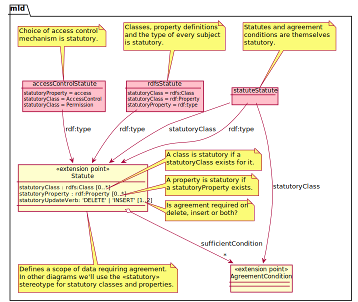
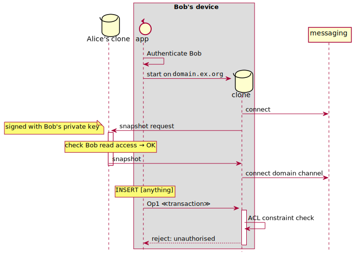
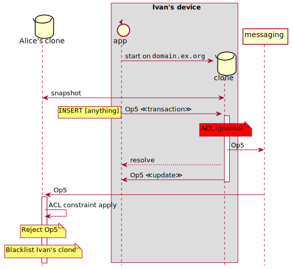
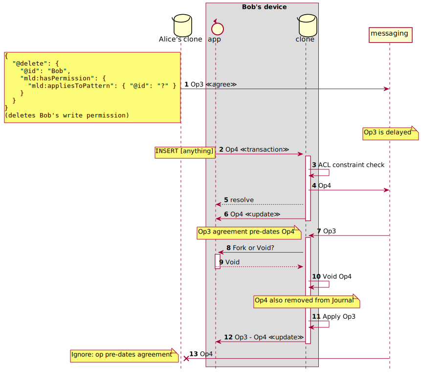
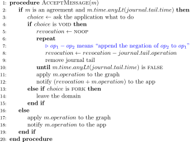
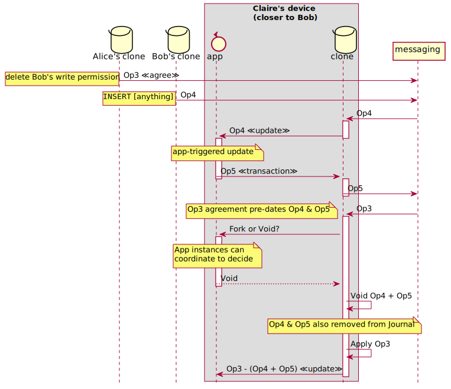

# Symmetric Unilateral Access Control

*This document is a design story with enough reasoning to justify a prototype implementation. A formal write-up of the design, its properties and its verification will follow.*

## abstract

In moving from a _static-by-default_ (centralised, serialised) data paradigm to a _live-by-default_ (decentralised, eventually consistent) one, it becomes necessary to allow coordinated agreements between participants, for scenarios where fully conflict-free intention preservation is not possible. We make a narrative argument for a general model of agreements to support significant changes of state, which also leads to a pattern for fully decentralised access control. Then we consider how this model may be realised in **m-ld**, with sufficient detail to begin a prototype implementation.

## analysis

### conflict freedom

In principle, data in **m-ld** is both **decentralised** (not requiring central coordination) and **strongly eventually consistent** (SEC) [@shapiroConflictFreeReplicatedData2011]. The latter property entails that every local user operation is committed immediately, without coordination via the network, and it is preserved in the final history.

These properties have been shown to be achievable for a selection of common data types, for which there exist Conflict-free Replicated Data Types (CRDTs). A **m-ld** [domain](https://spec.m-ld.org/#terminology) is a Resource Description Framework (RDF) graph, and a CRDT. In addition, **m-ld** provides a means to extend the RDF graph CRDT with embedded data types, such as a List [@svarovskyMldRealtimeInformation2021a].

Non-trivial CRDTs operate by taking advantage of underspecification in a basic data type's behaviour, particularly with regard to how concurrent operations give rise to a final state (e.g. a 'merge'). Different CRDTs for the same basic data type may have different expressed concurrent behaviours, but all with the property that one and only one final state is possible for any Set of concurrent operations.

From this, we can intuit that some data types may be so specified that a corresponding CRDT is impossible. In such a case, the specification of the data type is incompatible with SEC, and coordination becomes essential to consistency. Trivially, any data type that already uses coordination, such as a database or a ledger, is an example. But why are these data types specified with inherent coordination in the first place?

A financial ledger might be re-conceived as a CRDT. Each transaction on the ledger affects an account balance. Two transactions might both withdraw from the account, such that after each individually, the balance is still positive; but the final state after both is negative. Assuming that this is not permissible, we could say that one of the balances 'wins' and the other is declared _void_ – that is, entirely revoked – leaving a deterministic final state.

Besides SEC, practical CRDTs seek to preserve, as far as possible, the _intention_ of all operations, so that users are not surprised by the outcome of concurrent edits. Besides upholding the [law of least astonishment](http://www.canonical.org/~kragen/tao-of-programming.html#book4), intention preservation is important because data systems are not _closed_. A visible state of the system, for example after a local edit, can have consequences which are not under the control of the system – our users might have already spent the money that they withdrew.

### agreements

As argued in [controls](./controls.md), some state changes in the systems analysed seem to require the _agreement_ of system participants. We now notice that the requirement for agreement is associated with the potential for intention not to be preserved, because one user's changes may have to be completely voided. For example:

- State changes concurrent with a data schema change – the state may no longer be compatible with the schema
- State changes concurrent with access control changes – the concurrent change might not be allowed

For now, we informally specify that an "agreement" is a coordinated change of state, as distinct from an inherently uncoordinated conflict-free change. An agreement is binding on all participants, but its coordination may involve any subset of them, such as a majority consensus, or even just one participant who has the "authority" to unilaterally agree.

Existing inherently coordinated data types may also expose unagreed state, thus offering the option for a user to proceed at risk of their transactions being voided at some future time.

The language of agreements therefore allows us to describe a variety of data type categories as follows.

| data type category                          | agreement                | coordination by                                 | voiding                            |
| ------------------------------------------- | ------------------------ | ----------------------------------------------- | ---------------------------------- |
| CRDT                                        | none                     | none                                            | none ("preservation of intention") |
| Operational Transform                       | none                     | server                                          | none                               |
| Optimistically Locked                       | on commit                | server                                          | on lock failure                    |
| Blockchain ledger                           | eventual (longest chain) | "blockchain consensus" (various)           | effectively, for side-chains       |
| Ordered log                                 | on append                | majority consensus (typically; e.g. Paxos) | none                               |
| Locked ("pessimistic") e.g. FOR UPDATE | on request               | database                                        | none                               |

> Aside: what we have called "agreements" in existing data types tend to depend on coordination by technical components, dissociated from users. Servers, databases, and algorithms are determining winners and losers. This may be motivated by speed or fairness. But the choice of language also alerts us to our delegation of authority to non-human entities, and so invites us to watch for unintended consequences.

### statutes

Returning to the requirements of data schemas and access control, agreements can have two relationships to scopes of data, which we label as follows:

- A change to some data can _require_ agreement (the "subject" of the agreement). This is the data for which changes trigger an agreement.
- An agreement can _apply to_ some data (the "object" of the agreement). This is the data for which changes may be voided if they are concurrent with an agreement.

For example:

| subject             | change               | object                       |
| ------------------- | -------------------- | ---------------------------- |
| access control list | permissions          | access-controlled records    |
| data schema         | classes & properties | instances of changed classes |
| shopping cart       | checked-out          | purchased items & prices     |

In the access control example, we can further observe that an access control list is itself access-controlled; so subjects and objects can intersect. In the most general case, intuitively, agreements may therefore interact via their subjects and objects in complex ways.

To simplify the analysis we will consider a tractable but useful common case, which is a set of data that requires agreement to change, and affects everything. In other words, it is the subject of an agreement definition, for which the object is the whole domain. By analogy with legal systems, we will call such subjects _statutes_.

The consequence of a subject being a statute (i.e. it is _statutory_) is that if it changes, _any_ concurrent change is eventually voided. While this intuitively suggests a bottleneck and a risk of frequent voiding, we note that:

- This is the normal behaviour of ledgers, and even some high-throughput databases like [MongoDB](https://docs.mongodb.com/manual/faq/concurrency/).
- Subjects of agreements (including all our examples) change infrequently, while data that is not subject to agreement can change at high frequency, concurrently or offline.

Further, we can minimise or remove the risk of voided transactions by means of a two-phase agreement. This corresponds to a pessimistic lock:

1. A _lock record_ is added to the domain by agreement. The lock record identifies a user, and the data that it is locking. A lock record is itself an agreement definition.
2. Any change to the identified data then requires the agreement of the lock, which is to say the change has been made by the identified user; the user may also choose to release the lock.

With this method it is straightforward for a participant to check whether they currently own the lock, and if they do, their transaction will never be voided.

### authority

We have already informally introduced the concept of authority, as the ability to unilaterally agree a change – for example, a _lock_ is a temporary authority. Authority is one of a number of possible _conditions_ for an agreement; another might be consensus. Authority particularly begs the question: how can a participant trust another participant's claimed authority?

In a decentralised system, every compute node has the same inherent authority – differential authority is assigned to the participating security principal (e.g. the user). Intuitively, this assignment should preferably be part of the logically decentralised domain – in fact, this _must_ be the case, because any _reference_ to another dataset is itself a datum.

So in order to trust authority, a participant must trust the data. A natural step might be to digitally _sign_ data, so that it is practically impossible to forge. However, this is subject to recursion: why trust the signer's authority? (Note this is a separate concern to _authentication_; trust in the signer's identity is not the same as trust in their authority.)

All trust models are based on chains of trust. These chains can be arrived at by mathematical induction. We can trust the current state of the data if we can trust the prior state and the last operation (assuming operations are the only source of change, and they are correctly applied; see the [controls](./controls.md) document for a security context overview).

The base case of this induction is an empty domain (called _genesis_ in **m-ld**), in which there is nothing to trust. Let us assume that the first operation in the domain establishes an authority statute, such as "Alice owns this domain". Assuming a safe replication mechanism (we will return to this), any replica of this domain's data is now able to check whether a received operation is permitted. Did Alice make the change? – then it's permitted; otherwise it isn't. An allowed operation can then be an agreement to change the authority, for example to allow Bob to also make changes; and so forth.

We call this model **symmetric unilateral access control** (SUAC). Every peer independently and symmetrically applies the access control, embodied in authority statutes in the data it already has, without reference to any other system. We will analyse the properties of this model in the next section, in the prototype, and formally in a future phase.

## realisation

Applying this model of agreements to **m-ld** will involve two main exercises: first, to define an ontology for agreements, statutes, authority and locks, which can be used in a domain to drive behaviour; and second, to specify any changes required to **m-ld**'s protocol to support such behaviours. In both cases we will stop short of specifying code changes, as these are better suited to exploration in the prototype.

### ontology

**m-ld** domain data is an RDF graph (expressed as JSON-LD in the API). We will use [RDF Schema](https://www.w3.org/TR/rdf-schema/) as the ontology language, to naturally allow a domain to declare its schema with reference to our defined ontology classes. This is the standard RDF pattern for [semantic extensions](https://www.w3.org/TR/rdf11-mt/#semantic-extensions-and-entailment-regimes). The classes and subjects defined here form the base ontology for SUAC, and will be associated with implementation modules that affect the behaviour of **m-ld**, including [constraints](https://spec.m-ld.org/#constraints). This base ontology is itself extensible; and extensions may require their own implementation modules.

_To diagrammatically express RDFS Classes and Properties, as well as [subjects](https://spec.m-ld.org/#subjects) and their relationships, we will use a specialisation of a [UML Class Diagram](https://en.wikipedia.org/wiki/Class_diagram), as shown in the [key](./img/key.class.svg). The diagram notation will be used strictly, but following the narrative should give the reader an accurate understanding without having to fully grok the syntax._

_Agreements_ themselves do not need to be represented in the data, since they are an artifact of behaviour that is triggered by other classes (as we will see). Of course, in some use-cases it might be important to maintain a record of the agreement in the data, but that is left to the application to represent as it chooses.

Instead, we first consider how to express the subject of an agreement, by modeling [_statutes_](#statutes).

Starting with the `Statute` class itself, we define it as a scope of data for which an agreement is required, if the data is to change. The complexity in the diagram arises from how that scope is established; here we present two mechanisms, which are intended to cover the majority of use-cases. However note immediately that we are allowing for extensibility, by means of other properties or subclasses of `Statute`.

A `statutoryClass` is a way to make instances of a class statutory. This means that all changes to the properties of those instances will be subject to agreement. The statute instance identifies any number of `statutoryClass` properties. Default instances of `statutoryClass` are shown, including the recursive declaration that a Statute is itself statutory.

A `statutoryProperty` is a way to make instances of a property statutory. This means that all changes to that property (on any Subject) will be subject to agreement. Default instances of `statutoryProperty` are shown, including the declaration that the `rdf:type` of any subject is statutory. This may be problematic in practice, because it could require any new subject instance with a declared type to always require agreement – a better approach may be to have a separate constraint that prevents a subject type changing after it is created. We intend to explore this in the prototype.

A statute also specifies the _conditions_ which are sufficient for agreement on the proposed change. The choice of the 'sufficient' qualifier is for simplicity at this stage: it may be that in practice, other qualifiers such as 'required' or 'optional' will make the model more powerful (cf. [JAAS login module configuration flags](https://docs.oracle.com/javase/7/docs/api/javax/security/auth/login/Configuration.html)).

An `AgreementCondition` is an extension that defines the rules and behaviour of the condition. For example, a `RaftConsensus` condition could require that the agreed operation comes from a leader node elected using the [Raft](https://raft.github.io/) algorithm. An `External` condition could require some verifiable third-party token. We will explore more what it means to accept or reject an agreement below.

For access control, a key concept is [Authority](#authority), which combines a condition for agreement, and a permission to make a change. In this model permissions also exist independently of agreements: it is legitimate to control access to any data whether or not it is statutory. The link between agreements and permissions is realised in the extension behaviour activated by the `hasAuthority` agreement condition. Checking a proposed operation proceeds as follows:

1. Establish statutes and their conditions applicable to the data affected by the operation.
2. If `hasAuthority` is among the conditions, verify that the current user has authority over the affected data.
3. If so (and all other statutes involved also have sufficient conditions met), then begin the agreement process.

Note the two operation data checks involved – checking for a statute (meaning that the change must be agreed), and checking for user authority over the data.

Verifying authority is the same as for any other permission, as follows. For an operation it is necessary to identify:

- The security principal who enacted it. Here we give the example of using Public Key Infrastructure (PKI), in which a user has a certificate that can be used to sign operation messages (see below). A permission is assigned to a `Principal` in the data, having a certificate property. (We explore identity and authentication further in the [traceability](./traceability.md) design.)
- Whether the principal had a permission which _controls_ the changed data. Here we choose to support application of permissions to [SHACL node shapes](https://www.w3.org/TR/shacl/#node-shapes). This supports a data selector e.g. (informally) "all subjects having this Class", or "all data belonging to this group". Note that in the prototype, the available SHACL features will be the minimal necessary for demonstration of the principle.1

Since access control by "whitelist" permissions may not suit all use-cases, the choice of approach is made through the `access` property of the domain itself. (Note that this requires the domain to be represented as a subject in the data; this is an open [topic of discussion](https://github.com/m-ld/m-ld-spec/discussions/75).)

Document-level _read_ permission (see [confidentiality controls](./controls.md#confidentiality)) is assigned to a principal with a single permission subject which is affirmed to exist during clone recovery. See [§protocol](#protocol) for details, including the purpose and use of the domain `secret`.

### protocol

Here we elaborate the protocol with a set of example interactions; at the end we will summarise the new features to be implemented in the prototype.

A **m-ld** domain is created via a _genesis_ clone. Prior to creation, the user authenticates to the app. This serves two purposes:

1. To authenticate to the message service (if necessary).
2. To allow the app to do cryptography on the user's behalf, e.g. signatures.

Authentication to the message service is an optional first layer of defence for system access control. It prevents attackers with network access but no account with the authentication service from attempting to join a domain based on knowledge of its identity. While the domain will prevent them from reading any information (below), this has some network load and could be a vector for a denial-of-service attack.

The initialisation of the genesis clone on Alice's device then proceeds as follows.

Included in the [normal initialisation configuration](https://spec.m-ld.org/#initialisation) passed to the genesis clone is a _secret_ which will be used by the message service to control access to the operation messages for the domain (the realisation of this is service-specific; for publish/subscribe services like MQTT, this could correspond to a pubsub "address" or "channel"). We will see how this secret is used below; note that rotation of the secret is critical and will require a way to update it as well as initialise it.

To continue supporting basic use-cases having no need for schemas, access controls or agreements, the associated [ontology](#ontology) and behavioural extensions should be optional. The first task of the app is therefore to load the ontology (the full transaction is not shown, but assumed to be as normal). Doing so will trigger the engine to check for suitable installed behaviour modules in the runtime, and load them if necessary.

Note that at this stage, no access control mechanism has been associated with the domain, so the app is able to make any change without the user having permission. In our case, the app's first operation is to establish access control:

- The domain subject is created, with the "Permission" access control extension, and the secret already used to initialise the message service. This secret is now visible as data to clones on the domain (see below).
- Two principals are created: the local user Alice, with read permission and Authority over all data in the domain, and Bob, with read permission only.
- The sufficient condition for changes to access control is Authority.

The operation is first checked for changes to statutes, and indeed, they are found (domain access and permissions). There are no registered conditions for these statutes, and indeed no access controls at all (yet), and so the agreement transaction proceeds as normal, notifying the operation to the message service (there are no other clones, so this goes nowhere) and to the application.

Next, we consider the steps required for Bob to join the domain with his device.

Again, Bob must authenticate to the app, and then the clone may initialise and connect to the message service (but not yet to the domain channel, which is further protected by the domain secret). As a new but non-genesis clone, it must receive the domain data using a snapshot request from any available clone (Alice's clone being the only one; note that this may be technically routed through the message service, but it is characteristically a request/response). This request is signed (by Bob's private key, if PKI certificates are in use).

On receipt of the snapshot request, Alice's clone is able to inspect the signature and determine if a security principal exists in the data having the corresponding identity. In this case, this is so, and therefore Alice's clone responds successfully to the snapshot request.

Having the data, Bob's clone is now able to read the domain secret, and so connect to the domain channel on the message service.

At this point, Bob can read data on the domain, and have his clone be updated with the latest operations. However, he is still unable to write to the domain, because he does not have a `WritePermission`. In the normal operation of a clone engine this can be checked locally, and so no attempted transaction will succeed (as shown).

To authorise Bob to make write operations, Alice needs to issue an ACL change agreement.

The operation comprises the addition of a `WritePermission` to Bob's set of permissions (noting that **json-rql** updates are _overlays_, so Bob's `Principal` now has both read and write permissions).

As this operation itself requires authorisation, it will already have been checked in Alice's clone. Upon arrival at Bob's clone it is symmetrically checked again. In principle, this is because Bob's clone has no knowledge of the trustworthiness of Alice's clone or its domain – although this stance might seem undeserved because Bob has ony just receved Alice's snapshot. (In practice, it may be desirable to bypass authorisation checks for operations originating in a 'trusted' clone; but this would be an optimisation. See also [§trust](#trust).)

The authorisation check requires that the operation was signed by Alice (using her private key, if PKI certificates are in use). Bob's clone is therefore able to confirm that permissions exist for Alice to make the changes.

Now having write permission for any data in the domain, Bob is able to enact a transaction, and have it succeed and be notified to Alice (unless he attempts to modify a statute – in which case he is unable to satisfy the Authority agreement condition).

Let us consider the case in which an engine is actually malware, and permits unauthorised transactions.

(Note that this case assumes Ivan is a Principal; we have omitted the setup for brevity.)

The clone on Ivan's device does not correctly apply access control: in this case, it has allowed a transaction for which Ivan does not have a `WritePermission`. When this operation arrives at Alice's clone, the (normally symmetrical) application of access control will reject it. Alice's clone thereby retains its data integrity; but also, it knows that it has diverged ("forked") irretrievably from Ivan's clone. It must therefore ignore any further operations from Ivan's clone.

(We note that in practice there may be a need for such blacklisting to be reversible.)

We now consider the ramifications of concurrency in this protocol. First, we consider a case in which Alice revokes Bob's access simultaneously with Bob making a change.

The revocation of Bob's write permission is a change to a statute and therefore invokes an agreement. So far we have not distinguished the behaviour of _agreement_ operations (marked ≪agree≫) from other operations, except in how they are triggered and checked. Here we see how an operation that is concurrent with an agreement can become _voided_.

The agreement _Op3_ arrives at Bob's clone (**7**) after processing of the incompatible operation _Op4_. This can be detected from the operation's logical clock time, which will have a lower value for Bob's clock. For a normal operation this would not affect processing, because _Op4_ was not causally related to _Op3_. However because _Op3_ is an agreement, Bob's clone knows that it has made an incompatible change.

At this point, the consistency of the clone with the rest of the domain can only be recovered by voiding the incompatible transaction(s). Another option which retains the incompatible operation is to explicitly _fork_ the domain into a new domain, ignoring the agreement. This choice will be highly use-case specific and so is delegated to the app (**8**; this may in turn present the choice to the user).

Since this analysis is primarily concerned with single-domain consistency, we will not analyse the forking option any further (it is also related to an [investigation ticket](https://github.com/m-ld/m-ld-spec/issues/68)), and focus on voiding the incompatible operation.

Voiding requires that the operation is made as if it never existed. In some platforms with low-level transaction undo logs, such as databases, this may be possible natively; in others it may require the operation to be logically _reversed_. In either case, it is also necessary to:

1. Remove the operation from the clone Journal, so it does not appear in peer clone recovery.
2. Notify the application of the overall effect, so that user interface or other data dependencies in the app can be notified (**12**, shown as _Op3 minus Op4_, i.e. _Op4_ has been negated).

The overall operation, generalised to any number of voided operations, can be summarised as follows:

Finally, when _Op4_ arrives at Alice's clone, it can be seen to pre-date the last journaled agreement, _Op3_. In this case, Alice's clone can safely ignore the message. In general, all correct clones will eventually either ignore or void _Op4_, depending only on the order of arrival. For example, let us add Claire, who is geographically close to Bob and therefore receives his messages faster than from Alice. She not only receives _Op4_, but also (quickly) makes a new transaction prior to receiving _Op3_ from Alice.

In this case we have a short causal chain of operations, _Op4_ and _Op5_. Since _Op5_ was _caused by Op4_, we must suppose (in the absence of other information) that its intention is no longer valid, and so it is included, as per the pseudocode above, in the transactions to be voided upon on the arrival of the agreement _Op3_. We note in passing that should Bob have decided to fork the domain (ignoring the agreement), Claire could also choose to fork, and join Bob's new domain. Doing so would require some coordination between Bob and Claire, which we leave unspecified in this analysis.

### trust

Clone recovery by snapshot presents a unique situation with respect to SUAC, because the base case for the induction of data integrity is not an empty (genesis) domain but a dataset acquired from a peer of unknown trustworthiness (according to the logical model of SUAC). How can a clone trust the snapshot it receives? (Note that in **m-ld**, a snapshot does not include any journal entries; in any case, those could also be falsified.)

In a peer-to-peer system, we could choose to assume that a majority of peers are trustworthy; however:

1. This does not necessarily include the peer from which we received the snapshot.
2. Some peers may be offline – in the worst case, every online peer may be malicious.
3. At any moment, peers can have different data content, due to concurrent transactions and messages in-flight.
4. Majority consensus does not prevent Sybil attacks, which are easier when replica count is low (the attacker adds multiple malicious peers to attain a majority).

We could generalise this problem to any circumstance in which a clone is trusting a peer – which therefore includes any recieved operation. The operation may validate for both access control and signature identity, but may still be forged (e.g. by malware on the user's device). Ideally, we would like a way to verify, at any time – but particularly after snapshot recovery – that the current state of domain data in a clone is "correct" with respect to the rest of the domain (the definition of correctness is that the clone _would_ reach consistency with the domain if all operations were to cease).

In common with the general realisation of SUAC, we choose to provide this by means of an extension. This is because different architectures will have different trust models. In particular, an architecture having one or more central server-based clone (as is the case with both CIC and p2pl-doc) can direct snapshot requests to this clone, and therefore have no need of a fully peer-to-peer trust model for snapshots. A suitable extension point already exists in the Javascript engine for directing snapshot requests: the "remotes", which presents the domain as a whole, via the message service, to the local clone (see the [interface definition](https://github.com/m-ld/m-ld-js/blob/a062882c659e09ae6feec643b888ba261938d915/src/engine/index.ts#L174)). We will explore the necessary modifications to this extension point in the prototype.

For completeness, we conclude this section with a candidate model for fully peer-to-peer snapshot trust, as follows.

With reference to point 3 above we notice that in practice, clones will frequently converge on data content. Exactly how frequently will depend on the pattern of operations in the domain; informally, we can say that frequent convergence is the root expectation in most use-cases – for example, collaborative document editing by humans would not be viable if everyone were typing furiously at all times. In addition, statute agreements, a building block of SUAC, provide a _guarantee_ of convergence for "significant" data changes.

Therefore, it is possible to envisage a scheme in which clones periodically publish the current hash of their data content. This hash can be computed for a snapshot as it arrives, and incrementally during online operation (a merkle tree may be suitable). Upon receipt of such a hash, a clone will check the value against their own hash; or even against a tunable history of prior hashes. A mismatch will alert the clone to a divergence. While temporary divergence is normal, chronic divergence (for example, extending over multiples of the networtk timeout) will eventually become suggestive of a fault or a breach of trust. The confidence assigned to this can be adjusted for the number of clones online, and whether they have been trustworthy in the past. A clone that concludes it has diverged from the domain then has the choice of recovering from another snapshot, and repeating the process.

This scheme is probabilistic (trust is non-binary) and eventual (detection is not necessarily immediate). It is likely to require tuning for different use-case architectures. In these characteristics, it has some similarity to schemes in other decentralised architectures like [peer witnessing in Holochain](https://developer.holochain.org/concepts/1_the_basics/#how-holochain-does-things-differently) and [node age in SAFE Network](https://primer.safenetwork.org/#ch12). However, these technologies are _platforms_, which intend on having large numbers of nodes. A **m-ld** domain representing a shared document, in contrast, may only be shared to a handful of locations. This means a breach of trust at any location could have proportionally higher impact, but also such locations will more often be of known or controllable trust (such as on corporate devices).

---

_For bibliographic references, see the [project references file](../references.bib)._

1. In a previous version we suggested that write permissions could apply to an arbitrary **json-rql** pattern. In this scheme, permission checking could become an unbounded query optimisation problem. Use of a SHACL shape offers similar ultimate flexibility (informally, SHACL was [influenced by SPIN](https://spinrdf.org/spin-shacl.html), which represents "SPARQL rules and constraints"; **json-rql** being a serialisation of SPARQL), but is more straightforward to author, and to restrict to features suitable for the prototype.
