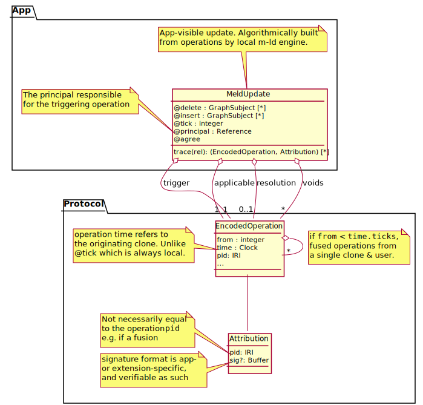

# Traceability

*This document is a design story with enough reasoning to justify a prototype implementation. A formal write-up of the design, its properties and its verification will follow.*

## abstract

Traceability and non-repudiation of information is mandated in our example systems, CIC and p2pl-doc, with specific requirements on the former and general document management expectations on the latter. Here we consider how to reliably record data operations in an audit log, with optional strong (cryptographic) binding to user identities, for the real-time information in these systems being managed using **m-ld**. First, we analyse requirements for the system, including how user identity can be made available to **m-ld**. Then, we consider three candidate technical approaches to the recording of the audit log, and select one for prototyping.

## analysis

_Note [CIC auditing objectives](../threats/e-invoicing.md#auditing) and  [p2pl-doc auditing objectives](../threats/legal-docs.md#auditing)._

In order to reliably trace information changes, both the affected information and the affecting security principals must be strongly identified. By 'strong' we mean that the identifier is stable for the lifetime of the audit log, and that applicable information for the identity can be retrieved using it.

### principals

Security [principals](https://en.wikipedia.org/wiki/Principal_(computer_security)) include human users, and machines (hardware plus software). A required security property for principals with respect to the audit log is [non-repudiation](https://en.wikipedia.org/wiki/Non-repudiation).

In information systems, machines necessarily act on behalf of users – who obviously do not have physical access to storage or networking. The general expectation for audit logging is that the user who initiated an action is strongly associated with the record of the action. It is not usually expected that the 'machine' used is equally associated with the action. Partly this is due to the deep complexity of guaranteeing that certain code – and no other code – was actually executed. Conventionally, this is mitigated with:

1. Verified installs – users install signed code from trusted sources e.g. app stores, and are expected to use that installed code.
2. Dynamically loaded apps – such as browser Javascript, which is downloaded from the same domain as the data being operated on.
3. Server-side processing – three-tier apps execute critical business logic in centralised, controlled environments.
4. Regulations – governing systems, and often requiring user verification of key actions e.g. 'electronic signatures' in [21CFR Part 11](https://www.fda.gov/regulatory-information/search-fda-guidance-documents/part-11-electronic-records-electronic-signatures-scope-and-application).

Decentralised systems cannot in principle apply these mitigations, because they all require some form of centralised authority – an app store, a domain or app server, or a regulatory body. This has led to the development of consensus-based solutions such as [smart contracts](https://en.wikipedia.org/wiki/Smart_contract), with ongoing research into protections against [Sybil attacks](https://en.wikipedia.org/wiki/Sybil_attack) and  [Byzantine fault](https://en.wikipedia.org/wiki/Byzantine_fault) tolerance. As also noted in the [SUAC trust model](./suac.md#trust), these approaches generally (and rather ironically1) require the 'platform' itself to be pervasive, with (sometimes elaborate) sufficiency criteria for the proportion or distribution of benign nodes and agents.

Since **m-ld** is a component, not a platform, it is neither possible not desireable to _require_ the application of any of the above strategies (centralised or decentralised) – instead, our approach is to provide suitable support, such as extension points, and guidance.

For the purpose of machine identity, we will categorise code as follows:

- **Platform** code is the local system in which the app and **m-ld** are running, e.g. a browser and operating system.
- **App** code is the local application, excluding the embedded **m-ld** engine. This category includes app code running on a server, and **m-ld** extensions loaded by the choice of the app or its data.
- **Operational** code is triggered by the local user and its actions are expected to be attributed to the user (as above).
- **Autonomous** code is not triggered by the local user.

With **m-ld**, autonomous code may be triggered by the arrival of actions from another user, or in the background. These should be either well-known algorithms (i.e. they are published as specifications, of **m-ld** or of an extension) or application code.

1. The core data structure of **m-ld** requires local processing of remote operations, to converge state.
2. App code is notified of remote data operations and may autonomously make consequential changes. This most often occurs in extensions such as [constraints](https://spec.m-ld.org/#constraints).
3. The clone engine may perform administrative actions at any time, while the local user is quiescent. This includes fusion of high-frequency entries in the journal (e.g. while another user is typing furiously), which compresses the entries into one entry with the same overall effect.
4. User operations may be _voided_ (revoked from the domain) as a result of [conflict with an agreement](./suac.md#agreements).

However, these autonomous activities may be under the general oversight of the user by virtue of executing in a user session, a user-installed app, or in the user's operating system account (or all three). Therefore in some trust models, it would be legitimate to trace the results to the user's identity (e.g. to find the origin of suspicious activity). In our design we will allow for both user identity and machine identity to be attached to audit log entries.

Attachment of a security principal's identity to data can be by association (e.g. in the same audit log entry) or strongly by means of a digital signature, depending on the use-case requirements. In **m-ld**, audit events arise in user-local apps, which are outside any data centre's trust boundary. Therefore we propose that digital signatures are a requirement for CIC and p2pl-doc traceability.

Note that the SUAC model already requires that operation messages can be verified to originate from an identified user principal, with Public Key Infrastructure (PKI) signatures given as an example technical approach. Here, we note further requirements for:

- machine identity
- verifiable signatures on audit entries
- offline signatures (to support offline working; this precludes e.g. a server round-trip to sign data)
- reliable timestamps on audit entry signatures (use of an RFC 3161 timestamp authority may be mandated)

The table presents a review of some possible technical identity models available in different environments, and their amenability to the use of cryptographic digital signatures. We will choose one of these models for prototyping, with extensibility to support others.

| identity model                                               | principal types | environments                                                 | digital signatures (inc. offline)                            | prototype |
| ------------------------------------------------------------ | --------------- | ------------------------------------------------------------ | ------------------------------------------------------------ | --------- |
| [WebID](https://www.w3.org/wiki/WebID)                       | user            | with a [protocol implementation](https://www.w3.org/2005/Incubator/webid/wiki/Implementations) | Yes. User owns an asymmetric private key.                    | ✔︎         |
| [Decentralized Identifiers](https://w3c.github.io/did-core/) | user            | with implementation for [method](https://www.w3.org/TR/did-spec-registries/#did-methods) in use | Yes, if the user owns an asymmetric private key (not always required). | ✗         |
| [PKI](https://en.wikipedia.org/wiki/Public_key_infrastructure) | user, machine   | most environments                                            | Yes. User/machine owns an asymmetric private key.            | ✗         |
| Identity service, using browser cookies                      | user            | browsers                                                     | Not natively. Data may contain a key†.            | ✗         |
| Identity service, using [JSON Web Tokens](https://jwt.io/)   | user            | most environments; an issuing service is required            | Not natively. Data may contain a key†.            | ✗         |
| operating system account                                     | user, machine   | desktop & mobile native apps                                 | Typically yes, with a provider account, e.g. [AppleID](https://developer.apple.com/documentation/authenticationservices/implementing_user_authentication_with_sign_in_with_apple), Windows365, Google | ✗         |

† Token-based authentication systems do not provide local security principals with a key for signing data, as they are primarily used in hosted architectures where digital signing is done on the server. However, the token could _contain_ a suitable key, which has the same validity period as the token. Since signature validation generally happens online – because a message with a signature has just been received – the validation of the signature key may require a server call.

### audited data

Document identities are required in p2pl-doc for traceability to other systems such as court case management systems and printed (possibly redacted) paper documents. In **m-ld**, all Subjects are strongly identified with IRIs – by default, a combination of the "domain" (shared dataset) identity, provided by the app, and the [Subject](https://spec.m-ld.org/#subjects) `@id` property. For the purposes of p2pl-doc, then, the app architecture just needs to ensure that the domain identity is sufficiently unique for traceability.

In addition to identifying a document, some use-cases may require the document content at some moment in history, e.g. the version that was exported. This is a common feature of document management systems. With **m-ld** there could be two primary ways to offer this:

- The current state of a clone could be "rewound" to a specific transaction, identified by the transaction ID or clone [tick](https://spec.m-ld.org/#events), by reversing the operations that have happened since (note that reversing an operation is also required for SUAC). This would be a new engine feature.
- A separate system could be used to store version snapshots at suitable junctures or intervals.

As a versioning feature would require substantial effort to implement, and is only tangentially related to the goals of this security project, we will not consider it further.

## realisation

We have considered the following three technical approaches for implementing audit logging in **m-ld**.

### 1. journal

The clone journal is a log of operations retained by a clone, primarily for collaboration with other clones that are recovering from a period offline, and in SUAC for reversal of operations that are found to be in conflict with an agreement. The journal is internal but there are use-cases, such as auditing, which may benefit from exposing it to the application with an API (see the [enhancement ticket](https://github.com/m-ld/m-ld-spec/issues/70)).

The advantage of using the journal for auditing is that it is already, conceptually, a log of operations; and it is just as highly available as the domain information content. Further, the journal is already able to fuse sequential entries, which is currently done to save on storage utilisation (done in the Javascript engine while the user is quiescent).

Despite the apparent conceptual and requirements match, there are a number of potential problems with using the journal directly for auditing. These primarily relate to additional complexity incurred by overloading the journal's original purpose.

1. Each clone maintains its own journal. Due to the possibility of concurrent operations, clone journals are not identically ordered. Conceptually this could complicate auditing since switching from one clone to another during the audit (for example overnight) could show duplicate or missed operations. In practice this may not be a serious issue.
2. A clone is at liberty to drop journal entries which are unlikely to be needed again, to save on storage utilisation. This depends on the application architecture, but in extreme cases a clone may choose to drop the entire journal. This could be worked-around, e.g. by marking some clones as 'audit masters' and using configuration to prevent them from truncating their journals.
3. The operations stored in the journal are not necessarily the same as the operations received at (or originating in) the clone. There are a number of reasons for this:
   1. Fusion of sequential entries.
   2. During clone recovery, fused operations received from a collaborator's journal may be adjusted ("cut") to allow for overlapping entries the recovering clone has previously received.
   3. Voided operations under SUAC may be entirely removed from the journal.
4. The journal does not record its own administrative activities (fusion, cutting, and voiding; see point 3).
5. The heuristic used by an engine to decide whether and when to fuse entries balances resource utilisation (storage and compute), within the constraints imposed by the low-level cloning protocol. The additional requirements of auditing will complicate these decisions, and the result could be detrimental to both use-cases.
6. The journal's raw data content would need to be augmented with timestamps from a reliable time source. This augmentation must happen at the time of operation creation. If an RFC 3161 timestamp authority is in use this would incur a network round-trip, which will not work offline, and is likely to cause a bottleneck during high-frequency updates – and so contravene the [realtime data principle](https://m-ld.org/doc/#realtime) of **m-ld**.
7. If user identities are pseudonymised in the data, then reversing the pseudonymisation for the auditor is required. The de-pseudonymised identity must not be stored with the journal, since it is then at risk of being read directly from the user device storage. Therefore this augmentation would have to be performed during auditing, or on transfer of events to another system.

> ✗ This option will not be protoyped, unless the selected option proves unworkable.

### 2. operations

Above, we have used the term "operation" to generally refer to any change to domain content. In the core of **m-ld**, this term is more specifically used to refer to changes that are propagated from clones, through the message service, to other clones (note we use "message service" loosely to mean the technology in use for publishing operations; it may be fully decentralised). Journal entries are derived from operations, but as already noted, they may be modified by the engine in order to fulfill the purposes of storage optimisation and clone recovery.

Operations are not stored by **m-ld**, and so using them would require a dedicated auditing system. However, this avoids the general 'overloading' problem identified for the journal option above. The auditing architecture can make its own decisions about log retention and compression, and to augment entries as required. In particular, trusted timestamps can be obtained asynchronously, instead of holding up an operation commit. The scheme used for compression and time stamping can be tuned to the demands of auditing, e.g.:

- Debounce sequential user operations for some time period e.g. 5 seconds; unless the operation is an agreement, or some other significant singular event according to the application semantics.
- Compress these operations to auditable events and send them to the auditing system.
- Obtain and associate trusted timestamps to events, on receipt, in the auditing system itself.

There is no direct API in **m-ld** giving an app access to operations – because no individual clone is guaranteed to receive all unmodified operations. We therefore have to consider where to intercept _published_ operations.

#### at every clone

An extension point does exist for the "remotes" object which is responsible for publishing operations to the message service. A remotes could be provided that passes updates to the auditing system. To guarantee that all updates are passed, each clone would pass only the operations that it creates. However:

1. In case the clone is partitioned from the auditing system, the connection must allow offline append (e.g. with an 'outbox' queue). Since this offline cache is (largely) redundant with the journal, this puts additional load on local storage.
2. This approach is susceptible to malware – an 'insider' can cover their tracks by using a clone engine that sends incorrect entries.

#### at the message service

The auditing system itself could _subscribe_ to the message service and so receive all operations. This approach protects against malware by ensuring that audit entries correspond to actual operations published (strictly, the trust level applicable to the audit events is matched to the trust level of the information published by the clone, see [SUAC §trust](./suac.md#trust)). However:

1. When a clone recovers from a period offline, it publishes its offline operations from the journal – these may be fused.
2. In a real system, the auditing system may be temporarily partitioned from the message service, resulting in missed operations.

In general, intercepting operations also fails to capture the voiding of an operation under SUAC, because such voiding happens unilaterally at every clone.

>  ✗ This option will not be protoyped, unless the selected option proves unworkable.

### 3. updates

In the core of **m-ld**, "updates" are operations notified to the app as events via the [clone API](https://spec.m-ld.org/#events). They are composed and ordered to strictly represent the updates being made to the clone's information content, so that the app itself can maintain any other local representations such as a user interface (UI). Updates will normally include operations that are subsequently voided, and the reverse operation when the voiding happens.

Taking these updates in turn, augmenting them as necessary and pushing them to a dedicated auditing system, has similar properties to the interception of operations; and no new API is required. However:

1. Updates have the same ordering as the journal, and will differ between clones. Care must be taken that only one clone streams to the auditing system at a time, and if this 'auditing clone' disappears (e.g. the node crashes), it must be restarted. This will not miss entries, because the clone can recover from another running peer. If the clone were running as a service, this would be a natural function of a scheduling system such as Kubernetes; and so this approach would be natural for hybrid systems like CIC and p2pl-doc. In fully decentralised apps the auditing clone would have to be selected by a leadership election scheme.
2. In case the auditing clone is partitioned from the auditing system, the connection must allow offline append (e.g. with an 'outbox' queue). Since this offline cache is (largely) redundant with the journal, this puts additional load on local storage. Again, this problem is mitigated by the use of a server-based auditing clone with enough storage to cover any brief periods of partitioning.
3. The operations emitted as updates are still not necessarily the same as the operations received at (or originating in) the clone. Due to use of the journal during clone recoveries, they may be fused, cut, or absent due to voiding (see §journal, problem 3).

To overcome this remaining problem, we need autonomous operation modifications made by clones to be reliably traceable to the operations that triggered them. We have already established that clones must have a machine identity (sometimes the current user's identity), and are therefore able to sign the results of their autonomous actions. We now add the requirement that the signed data includes, for each "triggering" operation:

- The identity of the triggering operation's originating agent.
- The identity of the triggering operation (not its data, as this would negate the purpose of fusion, in particular).

This approach does allow for the theoretical possibility that a user's action is not logged with its original content:

1. When a clone on a user device recovers from a period offline, the operations that it emits may include fusions of the user's individual actions.
2. If the auditing clone suffers a failure and recovers, rev-up operations fetched from a peer may:
   1. Include fusions of some user's individual actions.
   2. Exclude operations that were voided by the collaborator.

In all cases, fusions contain entries for only one user's actions, made sequentially. Therefore the logging of fusions seems uncontroversial for auditing purposes – especially if the auditing clone's app is also applying fusions of its own. However:

- The audit clone must trust that the fusion was constructed legitimately (i.e. not by malware) – see the [SUAC trust model](./suac.md#trust).
- Reliable timestamps will be applied at the time the fused operation is received by the auditing system, not necessarily the time the edits were actually made. (It would not be possible to use a timestamp authority offline anyway.)

The omission of a voided operation may seem to be more serious; however, note that this only occurs if the audit clone itself is offline (crashed or partitioned from the network). The purpose of logging voided operations is also somewhat obtuse, since by definition they do not contribute to the data. For now, we will accept this as a limitation of our approach.

The following diagram elaborates the API to be used to describe updates in the prototype, with traceability to "triggering" operations.

This API bridges the App and Protocol API. The already-existing `MeldUpdate` type in the App API will be augmented with a function `getOperation` to trace through to the underlying Protocol information that gave rise to the update.

There are a number of possible relationships among updates and operations, described below, each of which is well-defined in the **m-ld** protocol. This means that a sufficiently sophisticated auditing system would be able to re-create, and therefore verify, the trace provided.

1. `trigger`: this is the operation that directly triggered an app update, either a local `write` or an arriving remote operation. This operation always exists but is not necessarily recorded in the clone journal (see next).
2. `applicable`: this is the triggering operation, adjusted to remove any parts of it that have already been applied. This is relevant if the trigger is a fusion. This operation is always recorded in the clone journal.
3. `resolution`: if the applicable operation violated a constraint, then the update will combine it with a resolution. This relationship gives access to the raw resolution, which is also recorded in the journal.
4. `voids`: if the applicable operation is an agreement, it may have caused some operations to have been voided. This relationship gives access to precisely which operations were removed, in reverse order (as if each was undone). These operations will have already been removed from the journal.
5. Fused: if the applicable operation is (still) a fusion, it implicitly merges some original operations. These are never available locally, so are not accessible by `getOperation`. However, an auditing system could seek to discover the original operations from other clones. As noted above, this will only happen if the auditing clone is itself offline for a period.
6. Causes: all operations (except the very first) are causally predicated on the operations that happened before them in the clone where they originated. This is implicit in the ordering of updates visible to the local app (and therefore the auditing system). Note once again, however, that different clones may see different orderings.

Operations in the **m-ld** protocol are encoded as a 'tuple', a heterogeneous JSON array (see the [type definition](https://github.com/m-ld/m-ld-js/blob/73b00e83e4afc75e7c3e1d66273ae1eb58da220c/src/engine/index.ts#L159) in the Javascript engine), which has a well-defined serialisation with [MessagePack](https://msgpack.org/). This is used by 'transport security' extensions to generate signatures, which are represented in the protocol in 'Attribution' objects. The signatures are therefore verifiable during audit. However, note that all signatures are verified locally by the clone engine; so, if the clone is trusted not to be malware, for example an audit clone running in a trusted environment, then it is redundant for another part of the auditing system to re-verify.

>  ✔︎ This option will be protoyped.

---

_For bibliographic references, see the [project references file](../references.bib)._

1. "If only everyone would agree to do things my way, then everyone could be autonomous."

