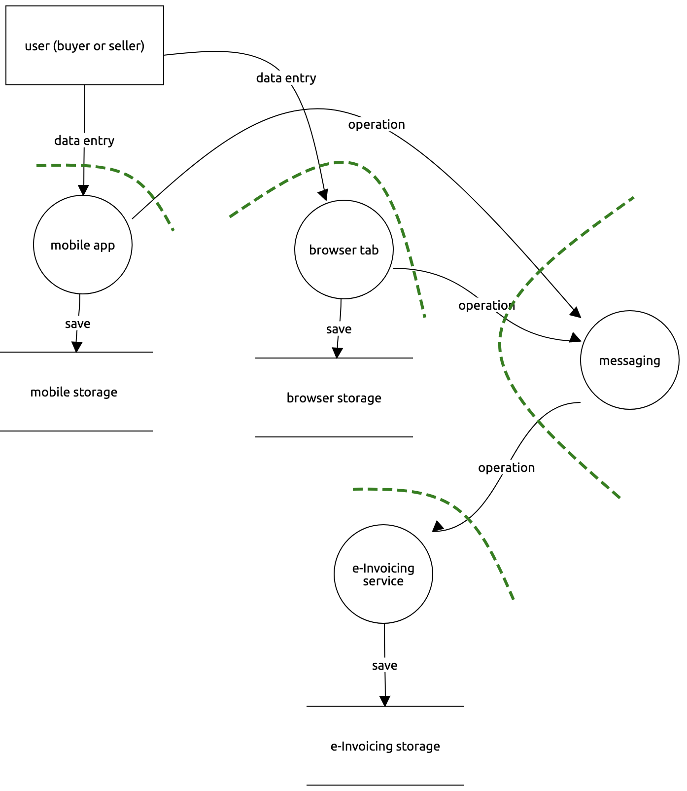

# Collaborative e-Invoicing Threat Model

[TOC]

## 0. objectives

Applicable policies?

Applicable standards?

| Objective       | Details                                                      |
| --------------- | ------------------------------------------------------------ |
| Confidentiality | *Out of scope*                                               |
| Integrity       | Adhere to data model Disallow invalid transitions State at *agreement* points can be signed |
| Availability    | Offline Multiple devices                                |
| Auditing        | All operations are timestamped (signed?) and attributable to a user identity Different histories due to concurrent/offline operations can be inspected at *agreement* points Divergent histories can be compared |
| Authentication  | Users are strongly identified Machines are strongly identified (applicable?) |
| Authorisation   | "Buyer" and "Seller" roles Apply [invoice data type access rules](https://github.com/federatedbookkeeping/research/issues/4) |
| Management      | Are there system administrative roles besides Buyer? What can they do? |

## 1. application profile

| Viewpoint           | Details                                                      |
| ------------------- | ------------------------------------------------------------ |
| Deployment          | Mobile devices (secured how?) Web browsers Public internet |
| Users               | Buyer Seller Admin?                                |
| Data                | [Collaborative e-Invoice content](https://github.com/pondersource/collaborative-invoice-composition/blob/main/index.ts) |
| Technology          | ...                                                          |
| Security mechanisms | Identity management? Link sharing? Integration with email systems? Persistent data store? (**m-ld** on server?) _**m-ld** security mechanism to be designed_ |

## 2. application composition

## 3. threats

### agents

| Agent | Motivation | Capability |
| ----- | ---------- | ---------- |
|       |            |            |
|       |            |            |
|       |            |            |

### attacks

| Category               | Attack | Vector | Agent |
| ---------------------- | ------ | ------ | ----- |
| Spoofing               |        |        |       |
| Tampering              |        |        |       |
| Repudiation            |        |        |       |
| ~~Disclosure~~         |        |        |       |
| Denial-of-Service      |        |        |       |
| Elevation of Privilege |        |        |       |

## references

[Invoice data type and access rules (Federated Bookkeeping research)](https://github.com/federatedbookkeeping/research/issues/4)

[Threat modeling mind-map (Freemind)](./threat%20modeling.mm)