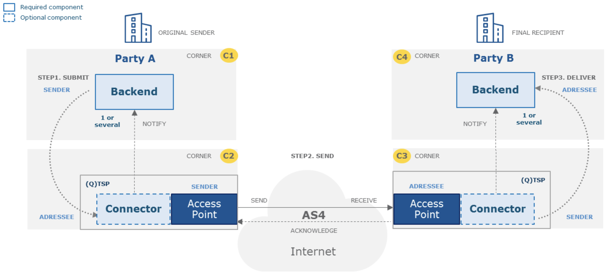

# Collaborative e-Invoice Composition Threat Model

> Collaborative e-Invoice Composition is an early-stage collaboration project between **m-ld** and [Ponder Source](https://pondersource.com/). Join us on [Gitter](https://gitter.im/federatedbookkeeping/community) to discuss ideas to transform procurement processes for the better.

This document presents a threat model for Collaborative e-Invoice Composition (CIC). The vision behind CIC is that _a buyer and a seller can collaborate in real-time to determine the contents of an invoice_.

The conventional approach to invoicing involves a _process_ (the procurement) and a number of exchanged _artefacts_ (a request for quotation, an order, an invoice, a shipping note, etc). The concept of collaborative e-invoicing notices that while parts of the process have strict conventional rules (some with associated legal regulations), others can be modelled as a negotiation, or even – with implied mutual goodwill – a _collaboration_. If a technical system can be built that supports this model, while still assuring both parties of the security of the procurement transaction (even if goodwill is challenged), that transaction could be enacted without the significant overhead and complexity of repeated document composition and exchange.

See [collaborative-invoice-composition](https://github.com/pondersource/collaborative-invoice-composition) for more details of this concept. For the purpose of this document, we assume that the collaborative model of e-invoicing is viable as a future model for procurement processes, and focus on the security requirements which it entails.

## 0. objectives

The function of a CIC system is to allow the parties involved in a procurement transaction to contribute live changes to a single logical document – the "draft order" – which represents all the relevant information about the procurement. For example, the buyer can set the requested quantities of items to be bought; and the seller can set prices. Note that the language already implies authorisations – for example, the buyer is not allowed to set prices. This will be further refined by significant changes of state – for example, during a negotiation prices can change, but once payment has been processed, further changes may not be allowed.

### standards

Here we focus on e-invoicing standards relevant to the European Union.

E-invoice _content_ is subject to [Directive 2014/55/EU](https://eur-lex.europa.eu/legal-content/EN/TXT/?uri=CELEX%3A32014L0055), which "requires a European standard for the semantic data model of the core elements of an electronic invoice". This standard has been delivered as [EN 16931-1:2017](https://standards.cen.eu/dyn/www/f?p=204:110:0::::FSP_PROJECT,FSP_ORG_ID:60602,1883209&cs=104E4C4FA3744A8DEA8E98A7B500306FD). Its only security requirement is that "the application of this standard should comply with the requirements for the protection of personal data of Directive 95/46/EC, having due regard to the principles of privacy and data protection by-design, data minimization, purpose limitation, necessity and proportionality".

A standard for the e-invoicing _process_, also conforming to EN 16931, is [Peppol](https://peppol.eu/), "a set of artifacts and specifications enabling cross-border eProcurement. The use of Peppol is governed by a multi-lateral agreement structure". The process basis for the current version of Peppol is defined in its [‘BIS’ Specifications and Guidelines](https://peppol.eu/downloads/post-award/), in BPMN (Business Process Management Notation) diagrams throughout the documentation.

However, Peppol's primary function is to provide a _technical_ standard for e-invoice exchange. It therefore mandates certain infrastructure and security controls at an implementation level, in the [eDelivery Network](https://peppol.eu/what-is-peppol/peppol-transport-infrastructure/) standards, which are based on [CEF eDelivery](https://ec.europa.eu/cefdigital/wiki/display/CEFDIGITAL/eDelivery). In particular, this mandates a 'four corner model' for all message-passing, in which "information exchanged between the original sender in corner one and final recipient in corner four go via access points, corners two and three respectively" [@CEFEDeliveryBuilding2016]:

Since the CIC process is subtantially different to the document-exchange model of Peppol, we choose to reverse-engineer its threat model basis based on its process model, technical infrastructure and security controls. The following table summarises the immediately inferrable threats. The following sections will also make reference to Peppol sources, as appropriate.

| Technical Requirement                                        | Implied Threats (STRIDE)                                     |
| ------------------------------------------------------------ | ------------------------------------------------------------ |
| Trust is established using a Public Key Infrastructure (PKI) [@cicirielloPEPPOLTransportInfrastructure2011] | Spoofing Tampering Repudiation Information Disclosure |
| Service providers sign an agreement before they join the infrastructure • Agreement regulates responsibilities, requirements, liability • Compliance checks may be performed [@cicirielloPEPPOLTransportInfrastructure2011] | Repudiation                                                  |
| Secure communication protocols • Employs encryption, signing, certificates, security tokens [@cicirielloPEPPOLTransportInfrastructure2011] Message Integrity • Messages should be secured against any illegitimate and unauthorised manipulation during transmission. This should be ensured via an advanced electronic signature/seal. • Messages should be encrypted during transmission. [@CEFEDeliveryBuilding2016] | Spoofing Tampering Repudiation Information Disclosure |
| Operational security requirements for service providers • Firewalls, intrusion detection, patching, logging, penetration test [@cicirielloPEPPOLTransportInfrastructure2011] | Spoofing Tampering Repudiation Information Disclosure |
| Sender authentication • Sender Access Point vouches for sender identity [@cicirielloPEPPOLTransportInfrastructure2011] The identity of the sender should be verified with a high level of confidence, via an authentication process and/or the use of an advanced electronic signature/seal. [@CEFEDeliveryBuilding2016] | Spoofing Repudiation                                    |
| Addressee Identification • The identity of the addressee should be ensured before the delivery of the message, via an authentication process and/or the advanced electronic signature/seal. [@CEFEDeliveryBuilding2016] | Spoofing Repudiation Information Disclosure        |
| Time Reference • The date and time of sending and receiving a message should be indicated via a qualified electronic timestamp ensured by an advanced electronic signature/seal. [@CEFEDeliveryBuilding2016] | Spoofing                                                     |
| Proof of Send/Receive • Sender and receiver of the message should be provided with evidence of message sending and receiving. This should be linked to the date and time of send/delivery via a timestamp or a qualified electronic timestamp for qualified status. [@CEFEDeliveryBuilding2016] | Spoofing Tampering Repudiation                     |

Note that [in Norway](https://peppol.eu/what-is-peppol/peppol-country-profiles/norway-country-profile/): "In addition to the use of the Peppol infrastructure for eProcurement, Difi has started to use it in a more general eGovernment context. The ISO 20022 payment implementation (https://vefa.difi.no/iso20022/) is using the Peppol infrastructure added with an extra layer of end-to-end (corner1-corner4) security (Secrecy, Authenticity, Integrity and Traceability)."

An example commercial implementation of Peppol is [Basware](https://www.basware.com/). Their Personal Data Processing Appendix [@raevuoriBaswarePersonalData2020], Annex 2, reflects the requirements above but also includes additional security controls, suggestive of additional threats. While most of these are in-line with general cloud service provider practices (e.g. for ISO27001 compliance), selected controls are called out in the following table.

| Security Control                                             | Implied Threats (STRIDE)                                     |
| ------------------------------------------------------------ | ------------------------------------------------------------ |
| Personnel security (hiring, maintaining and terminating employees) | Tampering Information Disclosure Elevation of Privilege |
| Asset Management (data or asset disposal)                    | Information Disclosure                                       |
| Access Management (e.g. separate authorisation for administration; least privilege) | _all_                                                        |
| Service Resilience (fault tolerance; load balancing; denial of service protection) | Denial of Service                                            |

Other popular commercial systems for procurement follow a similar model, while not necessarily being Peppol-compliant.

[Tradeshift](https://tradeshift.com/)'s [Information Security Policy](https://tradeshift.com/agreements/information-security-policy/) makes specific mention of _traceability_: "keep over a reasonable period of time of the logs of the actions carried out in its Platform used as part of the Services", as well as compliance with SOC 1, SOC 2, ISAE 3402 and ISO27001.

[Kissflow](https://kissflow.com/procurement/)'s [FAQs](https://help.kissflow.com/en/articles/454087-faqs) make specific mention of the Payment Card Industry Data Security Standard; however for the purpose of this document, payment card transaction security is out of scope.

Existing electronic procurement standards, then, assume a process model focusing on document exchange, and making this assumption, are not directly applicable to CIC. However threats inferred from them are included below.

### confidentiality

A draft order must be confidential; visible only to identified user roles, e.g. buyer, seller, shipping agent, lender; and delegates such as notaries and solicitors.

At different stages of the procurement lifecycle, different visibilities apply. It may originate with the buyer (e.g. a tender or Request for Quotation, RfQ) or the seller (e.g. an auction), and at this stage could be shared with multiple second-parties, or even publicly. When a specific seller or buyer has been selected, the ongoing state of the procurement becomes private to the two parties. Note that this applies to the _current_ state; snapshots of _prior_ states may have been legitimately made at any time by parties with read access at that time.

Each party may associate private data with the draft order, such as alternative suppliers (buyer), or warehouse locations (seller). Other roles may share components of the document, for example, a shipping agent may have access to required information for a customs declaration, but not actual prices paid.

Also confidential is the _history_ of the draft order (see also §[auditing](#auditing)). Parties should only have visibility on

- the history of components to which they have access, and
- historical operations during the period of their read access.

### integrity

A draft order data model has invariants (e.g. quantity of an item is always greater than or equal to zero, and for discrete items must be an integer), as well as pre-conditions and post-conditions for operations (e.g. a quantity cannot be changed if its item has been shipped).

At any moment, the 'current' state of a draft order can be different between parties, e.g. if a change has just been made and has not been received by another party; this is especially manifest if one or other party is offline. Nevetheless, it is necessary for some states to be unambiguously 'contractual', e.g. if physical assets are to be committed, or for legal reasons. These _contract points_ correspond to documents in a conventional e-invoicing system, such as: tender, quote, purchase order, despatch advice, invoice.

The relevant security property of a _contract point_ is that it is non-repudiable by either party.

### availability

The CIC system must be sufficiently available so that it is never a bottleneck in the procurement process. In order to provide the advertised benefits over a centralised system it must also be available to an offline party – with the proviso that they will not see the activities of other parties; and that modifications made in this state may need to be negotiated once back online, prior to a _contract point_ (see §[integrity](#integrity)).

### auditing

All visible operations on a draft order must be attributable, non-repudiably, to a single actor identity (not just a role), and reliably time-stamped. This information must be available to an authorised auditor.

- A _visible_ operation is one that enacts an atomic change which can be seen by another party.
- An _actor_ can be a human being or a machine.
- A machine actor may only enact attributed operations by executing processes for which the process definition and inputs are common knowledge (for example, application of packing rates to line items). If these conditions are not met, the operation must be attributed to a human actor. Alternatively, the result of simple calculations need not be included in the shared draft order data at all, but calculated on display; e.g. totals.

For the protection of personal information, an operation actor assignment is not necessarily visible to roles other than the auditor. However, the actor's organisation affiliation (employer, or owner) must be visible to all parties with read access to the affected information.

The ordering of visible operations can theoretically vary between parties, for example due to concurrent or offline operations. While this may be accounted for in the data structure, such that the draft order _converges_ to the same state for all parties, the auditable history must preserve _causation_. This requires that if an operation _B_ follows an operation _A_ in the history of the party that enacted _B_, it follows _A_ for all parties.

### authentication

An actor (human or machine, see §[auditing](#auditing)) must be strongly identified and authenticated for access to a draft order according to its §[authorisation](#authorisation).

Authentication is defined in the [eIDAS regulation, Article 3(5)](https://www.eid.as/#article3) as “an electronic process that enables the electronic identification of a natural or legal person, or the origin and integrity of data in electronic form to be confirmed”. In the Peppol/CEF four-corner model, authentication strength is dependent on the security policy of the access point.

Specific authentication requirements are out of scope.

### authorisation

Existing e-Invoicing standards based on a document-exchange model do not define fine-grained access controls, as each document is immutable and sent explicitly to a known (and identified) recipient.

In a collaborative draft order, access control requirements must be explicit, based on:

- Role; e.g. a seller cannot change a line item quantity, and a buyer cannot change a price.
- State; e.g. a price cannot be updated after the 'purchase order' _contract point_ (see §[integrity](#integrity)).

An initial analysis of draft order access rules can be found in the [Federated Bookkeeping research project](https://github.com/federatedbookkeeping/research/issues/4). For this analysis, the objective is to be able to compute fine-grained authorisation according to a declared scheme.

### management

Management of a CIC system may include:

- Regulatory auditing (see §[auditing](#auditing));
- Local IT system administration;
- Installation, maintenance and training activities;
- Identity and authentication system administration (out of scope);
- Development and testing activities, including penetration testing;

Other management roles depend on the deployment model, and may include system and database administrators. These may be associated with sub-systems, e.g. the access points of a Peppol/CEF four-corner model.

In general all management activities are subject to normal ICT security good practices, according to applicable standards e.g. ISO 27001.

## 1. application profile

### deployment

### users

### data

### dependencies

## 2. application composition

## 3. threats

### agents

| Agent | Motivation | Capability |
| ----- | ---------- | ---------- |
|       |            |            |

### attacks

| Category               | Attack | Vector | Agent |
| ---------------------- | ------ | ------ | ----- |
| Spoofing               |        |        |       |
| Tampering              |        |        |       |
| Repudiation            |        |        |       |
| Disclosure             |        |        |       |
| Denial-of-Service      |        |        |       |
| Elevation of Privilege |        |        |       |

---

_For bibliographic references, see the [project references file](../references.bib)._
