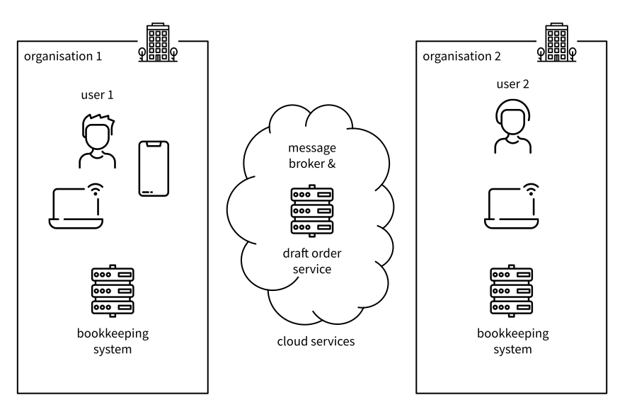
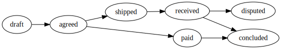
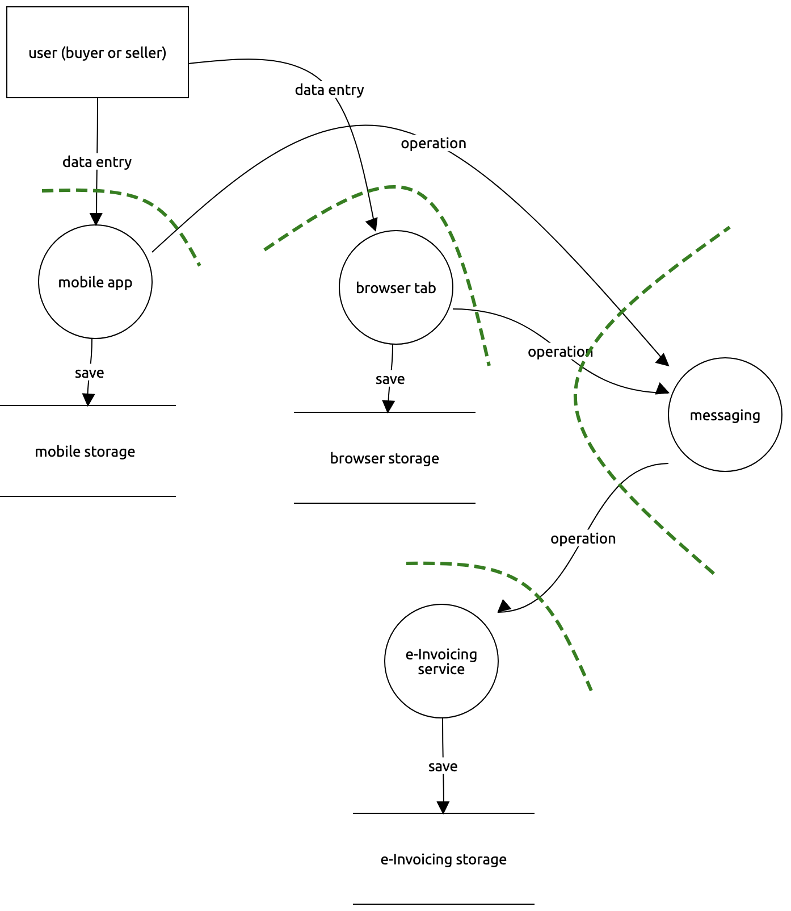
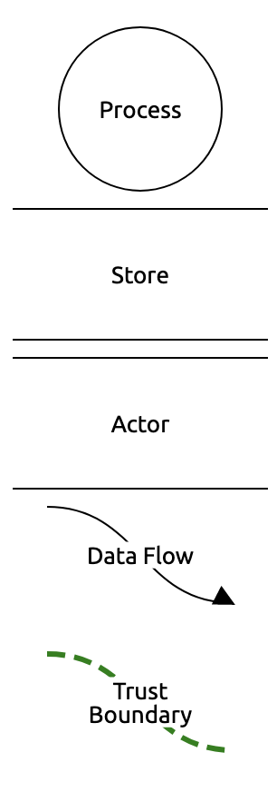

# Collaborative e-Invoice Composition Threat Model

_The motivation and structure of this document are described in the [folder README](./README.md)._

> Collaborative e-Invoice Composition is an early-stage collaboration project between **m-ld** and [Ponder Source](https://pondersource.com/). Join us on [Gitter](https://gitter.im/federatedbookkeeping/community) to discuss ideas to transform procurement processes for the better.

This document presents a threat model for Collaborative e-Invoice Composition (CIC). The vision behind CIC is that _a buyer and a seller can collaborate to determine the contents of an order_.

The conventional approach to ordering involves a _process_ (requisition and procurement) and a number of exchanged _artefacts_ (a request for quotation, a purchase order, a sales order, an invoice, a shipping note, etc). The concept of collaborative e-invoicing notices that while parts of the process have strict conventional rules (some with associated legal regulations), others can be modelled as a negotiation, or even – with implied mutual goodwill – a _collaboration_.

This collaboration is conceived as working on a _shared document_ representing the procurement. The document is simultaneously available in multiple physical locations. Changes to the document are committed to all locations, transparently, as fast as the network allows. If one location is offline, then the local changes are merged into every other location when the network becomes available.

If a technical system can be built that supports this model, while still assuring both parties of the security of the procurement transaction (even if goodwill is challenged), that transaction could be enacted without the significant overhead and complexity of repeated document composition and exchange.

See [collaborative-invoice-composition](https://github.com/pondersource/collaborative-invoice-composition) for more details of this concept. For the purpose of this document, we assume that the collaborative model of e-invoicing is viable as a future model for procurement processes, and focus on the security requirements which it entails.

## 0. objectives

The function of a CIC system is to allow the parties involved in a procurement transaction to contribute changes to a shared document – the "order" – which represents all the relevant information about the procurement. For example, the buyer can set the requested quantities of items to be bought; and the seller can set prices. Note that the language already implies authorisations – for example, the buyer is not allowed to set prices. This will be further refined by significant changes of state – for example, during a negotiation prices can change, but once payment has been processed, further changes may not be allowed.

### policies & standards

Here we focus on e-invoicing policies & standards relevant to the European Union.

E-invoice _content_ is subject to [Directive 2014/55/EU](https://eur-lex.europa.eu/legal-content/EN/TXT/?uri=CELEX%3A32014L0055), which "requires a European standard for the semantic data model of the core elements of an electronic invoice". This standard has been delivered as [EN 16931-1:2017](https://standards.cen.eu/dyn/www/f?p=204:110:0::::FSP_PROJECT,FSP_ORG_ID:60602,1883209&cs=104E4C4FA3744A8DEA8E98A7B500306FD). Its only security requirement is that "the application of this standard should comply with the requirements for the protection of personal data of Directive 95/46/EC, having due regard to the principles of privacy and data protection by-design, data minimization, purpose limitation, necessity and proportionality".

A standard for the procurement _process_, also conforming to EN 16931, is [Peppol](https://peppol.eu/), "a set of artifacts and specifications enabling cross-border eProcurement. The use of Peppol is governed by a multi-lateral agreement structure". The process basis for the current version of Peppol is defined in its [‘BIS’ Specifications and Guidelines](https://peppol.eu/downloads/post-award/), in BPMN (Business Process Management Notation) diagrams throughout the documentation.

However, Peppol's primary function is to provide a _technical_ standard for document exchange. It therefore mandates certain infrastructure and security controls at an implementation level, in the [eDelivery Network](https://peppol.eu/what-is-peppol/peppol-transport-infrastructure/) standards, which are based on [CEF eDelivery](https://ec.europa.eu/cefdigital/wiki/display/CEFDIGITAL/eDelivery). In particular, this mandates a 'four corner model' for all message-passing, in which "information exchanged between the original sender in corner one and final recipient in corner four go via access points, corners two and three respectively" [@CEFEDeliveryBuilding2016]:

Since the CIC process is subtantially different to the document-exchange model of Peppol, we choose to reverse-engineer its threat model basis based on its process model, technical infrastructure and security controls. The following table summarises the immediately inferrable threats. The following sections will also make reference to Peppol sources, as appropriate.

| technical rquirement                                         | implied threats (STRIDE)                                     |
| ------------------------------------------------------------ | ------------------------------------------------------------ |
| Trust is established using a Public Key Infrastructure (PKI) [@cicirielloPEPPOLTransportInfrastructure2011] | Spoofing Tampering Repudiation Information Disclosure |
| Service providers sign an agreement before they join the infrastructure • Agreement regulates responsibilities, requirements, liability • Compliance checks may be performed [@cicirielloPEPPOLTransportInfrastructure2011] | Repudiation                                                  |
| Secure communication protocols • Employs encryption, signing, certificates, security tokens [@cicirielloPEPPOLTransportInfrastructure2011] Message Integrity • Messages should be secured against any illegitimate and unauthorised manipulation during transmission. This should be ensured via an advanced electronic signature/seal. • Messages should be encrypted during transmission. [@CEFEDeliveryBuilding2016] | Spoofing Tampering Repudiation Information Disclosure |
| Operational security requirements for service providers • Firewalls, intrusion detection, patching, logging, penetration test [@cicirielloPEPPOLTransportInfrastructure2011] | Spoofing Tampering Repudiation Information Disclosure |
| Sender authentication • Sender Access Point vouches for sender identity [@cicirielloPEPPOLTransportInfrastructure2011] The identity of the sender should be verified with a high level of confidence, via an authentication process and/or the use of an advanced electronic signature/seal. [@CEFEDeliveryBuilding2016] | Spoofing Repudiation                                    |
| Addressee Identification • The identity of the addressee should be ensured before the delivery of the message, via an authentication process and/or the advanced electronic signature/seal. [@CEFEDeliveryBuilding2016] | Spoofing Repudiation Information Disclosure        |
| Time Reference • The date and time of sending and receiving a message should be indicated via a qualified electronic timestamp ensured by an advanced electronic signature/seal. [@CEFEDeliveryBuilding2016] | Spoofing                                                     |
| Proof of Send/Receive • Sender and receiver of the message should be provided with evidence of message sending and receiving. This should be linked to the date and time of send/delivery via a timestamp or a qualified electronic timestamp for qualified status. [@CEFEDeliveryBuilding2016] | Spoofing Tampering Repudiation                     |

Note that [in Norway](https://peppol.eu/what-is-peppol/peppol-country-profiles/norway-country-profile/): "In addition to the use of the Peppol infrastructure for eProcurement, Difi has started to use it in a more general eGovernment context. The ISO 20022 payment implementation (https://vefa.difi.no/iso20022/) is using the Peppol infrastructure added with an extra layer of end-to-end (corner1-corner4) security (Secrecy, Authenticity, Integrity and Traceability)."

An example commercial implementation of Peppol is [Basware](https://www.basware.com/). Their Personal Data Processing Appendix [@raevuoriBaswarePersonalData2020], Annex 2, reflects the requirements above but also includes additional security controls, suggestive of additional controlled threats. While most of these are in-line with general cloud service provider practices (e.g. for ISO 27001 compliance), selected controls are called out in the following table.

| security control                                             | implied threats (STRIDE)                                     |
| ------------------------------------------------------------ | ------------------------------------------------------------ |
| Personnel security (hiring, maintaining and terminating employees) | Tampering Information Disclosure Elevation of Privilege |
| Asset Management (data or asset disposal)                    | Information Disclosure                                       |
| Access Management (e.g. separate authorisation for administration; least privilege) | _all_                                                        |
| Service Resilience (fault tolerance; load balancing; denial of service protection) | Denial of Service                                            |

Other popular commercial systems for procurement follow a similar model, while not necessarily being Peppol-compliant.

[Tradeshift](https://tradeshift.com/)'s [Information Security Policy](https://tradeshift.com/agreements/information-security-policy/) makes specific mention of _traceability_: "keep over a reasonable period of time of the logs of the actions carried out in its Platform used as part of the Services", as well as compliance with SOC 1, SOC 2, ISAE 3402 and ISO27001.

[Kissflow](https://kissflow.com/procurement/)'s [FAQs](https://help.kissflow.com/en/articles/454087-faqs) make specific mention of the Payment Card Industry Data Security Standard; however for the purpose of this document, payment card transaction security is out of scope.

Existing electronic procurement standards, then, assume a process model focusing on document exchange, and making this assumption, are not directly applicable to CIC. However threats inferred from them are included below.

### confidentiality

An order must be confidential; visible only to identified user roles, e.g. buyer, seller, shipping agent, lender; and delegates such as notaries and solicitors.

At different stages of the lifecycle of a procurement, different visibilities apply. It may originate with a process at the buyer (a _requisition_, e.g. a tender or Request for Quotation, RfQ) or at the seller (e.g. an auction), and at this stage could be shared with multiple second-parties, or even publicly.

When a specific seller or buyer has been selected, the ongoing state of the procurement becomes private to the two parties. It is from this point that we model an order, which therefore has strictly one buying party and one selling party.

Each party may associate private data with the order, such as alternative suppliers (buyer), or warehouse locations (seller). Such associated data are out of scope of this analysis. Other roles may share components of the document, for example, a shipping agent may have access to required information for a customs declaration, but not actual prices paid.

Also confidential is the _history_ of the order (see also §[auditing](#auditing)). Parties should only have visibility on:

- the history of components to which they have access, and
- historical operations during the period of their read access.

| losses                      | category    | indicative severity (depends on) |
| --------------------------- | ----------- | -------------------------------- |
| Disclosure of trade secrets | Competitive | Low (scope of disclosure)        |

### integrity

The order data model has invariants (e.g. quantity of an item is always greater than or equal to zero, and for discrete items must be an integer), as well as pre-conditions and post-conditions for operations (e.g. a quantity cannot be changed if its item has been shipped).

At any moment, the 'current' state of an order can be different between parties, e.g. if a change has just been made and has not been received by another party; this is especially manifest if one or other party is offline. Nevetheless, it is necessary for some states to be unambiguously 'contractual', e.g. if physical assets are to be committed, or for legal reasons. These _contract points_ correspond to documents in a conventional e-invoicing system, such as: tender, quote, purchase order, sales order, despatch advice, invoice.

The relevant security properties of a _contract point_ are:

- It is non-repudiable by either party
- Its information is recoverable (e.g. by taking a snapshot and storing it separately)

| losses                   | category     | indicative severity (depends on)         |
| ------------------------ | ------------ | ---------------------------------------- |
| Payment without delivery | Replacement  | Medium (invoice value)                   |
| Incorrect payment        | Replacement  | Medium (invoice value)                   |
| Theft of goods           | Replacement  | Medium (invoice value)                   |
| Destruction of order     | Productivity | Low (procurement bureaucracy & progress) |

### availability

The CIC system must be sufficiently available so that it is never a bottleneck in the procurement process. In order to provide the advertised benefits over a centralised system it must also be available to an offline party – with the proviso that they will not see the activities of other parties; and that modifications made in this state may need to be negotiated once back online, prior to a _contract point_ (see §[integrity](#integrity)).

| losses       | category     | indicative severity (depends on) |
| ------------ | ------------ | -------------------------------- |
| Order delays | Productivity | Medium (attacker capability)     |

### auditing

All visible operations on an order must be attributable, non-repudiably, to a single actor identity (not just a role), and reliably time-stamped. This information must be available to an authorised auditor.

- A _visible_ operation is one that enacts an atomic change which can be seen by another party.
- An _actor_ can be a human being or a machine.
- A machine actor may only enact attributed operations by executing processes for which the process definition and inputs are common knowledge (for example, application of packing rates to line items). If these conditions are not met, the operation must be verified by, and attributed to, a human actor. Alternatively, the result of simple calculations need not be included in the shared order data at all, but calculated on display; e.g. totals.

For the protection of personal information, an operation actor assignment is not necessarily visible to roles other than the auditor. However, the actor's party affiliation (their employer, or owner, acting as buyer or seller) must be visible to all parties with read access to the affected information.

The ordering of visible operations can theoretically vary between parties, for example due to concurrent or offline operations. While this may be accounted for in the data structure, such that the order _converges_ to the same state for all parties, the auditable history must preserve _causation_. This requires that if an operation _B_ follows an operation _A_ in the history of the party that enacted _B_, it follows _A_ for all parties.

| losses     | category                       | indicative severity (depends on) |
| ---------- | ------------------------------ | -------------------------------- |
| Litigation | Fines & Judgements, Reputation | Medium (legal fees & fines)      |

### authentication

An actor (human or machine, see §[auditing](#auditing)) must be strongly identified and authenticated for access to an order according to its §[authorisation](#authorisation).

Authentication is defined in the [eIDAS regulation, Article 3(5)](https://www.eid.as/#article3) as “an electronic process that enables the electronic identification of a natural or legal person, or the origin and integrity of data in electronic form to be confirmed”. In the Peppol/CEF four-corner model, authentication strength is dependent on the security policy of the access point.

Specific authentication requirements are out of scope.

| losses                                                   |
| -------------------------------------------------------- |
| _per confidentiality, integrity, availability, auditing_ |

### authorisation

Existing e-Invoicing standards based on a document-exchange model do not define fine-grained access controls, as each document is immutable and sent explicitly to a known (and identified) recipient.

In a collaborative order, access control requirements must be explicit, based on:

- Party role; e.g. a seller cannot change a line item quantity, and a buyer cannot change a price.
- State; e.g. a price cannot be updated after the 'sales order' _contract point_ (see §[integrity](#integrity)).

An initial analysis of order access rules can be found in the [Federated Bookkeeping research project](https://github.com/federatedbookkeeping/research/issues/4). For this analysis, the objective is to be able to compute fine-grained authorisation according to a declared scheme.

| losses                                                   |
| -------------------------------------------------------- |
| _per confidentiality, integrity, availability, auditing_ |

### management

Management of a CIC system may include:

- Regulatory auditing (see §[auditing](#auditing));
- Local IT system administration;
- Installation, maintenance and training activities;
- Dependee system administration (e.g. directory system; out of scope);
- Development and testing activities, including penetration testing;

Other management roles depend on the deployment model, and may include system and database administrators. These may be associated with sub-systems, e.g. the access points of a Peppol/CEF four-corner model.

All management activities, when conducted according to normal ICT security good practice standards e.g. ISO 27001, should maintain the other objectives above.

Personal mobile and desktop devices should not need to have special security settings applied at the operating system level (although they may do, for example according to an organisational policy).

| losses                                                   |
| -------------------------------------------------------- |
| _per confidentiality, integrity, availability, auditing_ |

## 1. application profile

This section describes a hypothetical CIC application, using decentralised sharing of an order, with only enough detail to elucidate applicable security threats.

### deployment

The users of CIC interact with the system and each other via an app, available on mobile or desktop devices. For convenience, a web app should also be available. In all cases, the app will use local storage to persist order state between sessions, allowing an offline session to be interrupted without data loss.

Icons made by <a href="https://www.flaticon.com/authors/xnimrodx" title="xnimrodx">xnimrodx</a> and <a href="https://www.flaticon.com/authors/vitaly-gorbachev" title="Vitaly Gorbachev">Vitaly Gorbachev</a> from <a href="https://www.flaticon.com/" title="Flaticon">www.flaticon.com</a>

Users of the system will access each other and dependee systems via a local network or the internet. While fully peer-to-peer message delivery options are possible, they are not in widespread use, and so we model a message _broker_ as a service on the network, which is responsible for delivering control messages and order change operations. The broker may be implemented as a single server, a cluster, or a world-wide service; but for our purposes we will assume a  process with its own trust boundary.

For persistence of the order between sessions, and for parties to be able to access the latest available information whether or not another party is online, a copy of the order will be stored in a cloud service accessible to all parties – the _order service_. This persistent copy will be kept up-to-date as the network allows when edits are made; recognising that at any time, a party might have a local copy that is more recently updated, for example if they are offline.

### users

To support the objectives, users of the CIC system are modeled as follows. A user assigned one or more _user-roles_ in the scope of an order, and belong to a _party_, which itself has a _party-role_. (This is derived from the Peppol/CEF four-corner model, with an access point representing a party, which has its own associated users.)

| class      | instances                                            | scope            |
| ---------- | ---------------------------------------------------- | ---------------- |
| user       | _identified actors_ (human and machine)              | directory system |
| user-role  | writer, reader, signer, auditor, shipping calculator | order            |
| party      | _organisation or user_                               | directory system |
| party-role | buyer, seller, shipping agent, notary, lender        | order            |

Examples:

| user     | user-role | party               | party-role |
| -------- | --------- | ------------------- | ---------- |
| Bart     | writer    | Bart                | buyer      |
| Homer    | writer    | Springfield Nuclear | seller     |
| Mr Burns | signer    | Springfield Nuclear | seller     |

### data

An initial analysis of order data can be found in the [Federated Bookkeeping research project](https://github.com/federatedbookkeeping/research/issues/4). In addition to access control rules, an order is subject to state changes. Note that the referenced ticket proposes some fine-grained state transitions related to a negotiation e.g. 'seller proposes'. In this analysis we propose a free-form negotiation which more closely aligns with a human interaction, in between the required _contract points_ introduced in §[integrity](#intergrity).

Note:

- In larger-scale procurements, these contract points may apply to sub-parts of the order; for example, a purchase order may be fulfilled by multiple sales orders, as driven by e.g. batch manufacturing or stock availability.
- Some sellers may require payment prior to shipping; this is a specialisation of the general flow.

The following access rules apply to users and states:

| datum                                                | required party-role for write | required state for write |
| ---------------------------------------------------- | ----------------------------- | ------------------------ |
| seller, buyer and order identity                     | at creation only              | at creation only         |
| line item: product id, quantity                      | buyer                         | draft                    |
| line item: gross unit price, tax rate, shipping cost | seller                        | draft                    |
| shipping destination                                 | buyer                         | draft                    |
| total invoice amount (calculated)                    | _never_                       | draft                    |
| payment terms                                        | seller                        | draft                    |

In addition to current state data, we also consider the history of operations which give rise to it (the _journal_), for auditing purposes. Informally, these are statements of a delta from a previous state to a new state, e.g. "set the quantity of fuel rods being ordered from zero to ten".

If the journal contains multiple sequential entries originating on the same copy of the data (associated with a user identity and device, or a machine identity and address), then these entries may be compressed to fewer entries (or just one entry) according to some strategy intended for readability during auditing.

Noting that, in parallel with the order state, the journal also appears in multiple locations (see §[deployment](#deployment)): the _persistent_ copy will maintain an unabridged journal of all operations since the creation of each order. In contrast, the apps on user devices are free to discard local journal entries for operations that have been successfully transmitted, as required, to manage local storage utilisation.

### dependencies

| third-party system           | required | purpose & notes                                              |
| ---------------------------- | -------- | ------------------------------------------------------------ |
| identity management          | required | Provides identities for user authentication                  |
| authentication system        | required | Authenticates users to the required level of assurance and provides tokens or keys to the application so that it can act on behalf of the user. |
| bookkeeping system           | optional | Regulation-compliant system of record for financial transactions, conventionally a cloud or enterprise service. Contract point documents and totals will be stored here. |
| email/other messaging system | optional | Used for notifications and secure sending of contract point documents. |

## 2. application composition

The data flow diagram shows the processes, data stores, actors, data flows and trust boundaries which are subject to threats. Note that compared to the [deployment](#deployment) diagram above, only one user is shown, to avoid duplication for other equivalent users.

|  | key  |
| --------------------------------------------- | ----------------------------------------- |

### user

The human user of the order system interacts with the authentication service to obtain an authentication token which is valid for the local app. In this model we do not specify the implementation details of the token creation; nevertheless, something like [OpenID Connect](https://openid.net/connect/) would be typical. The authentication service itself is out of scope.

Once authenticated, the user makes data entries into the order, according to their access rights.

### local app

The local desktop or mobile app accepts data entries from the user and updates the local state of the draft invoice. The update are propagated to other copies of the order by publishing them to the messaging service. Changes are also propagated to the local storage on the device, so that if the network is unavailable, they are not lost when the app is closed or otherwise terminates.

Note that data entry, operation publication and saves to local storage may be subject to batching or other optimisations to limit traffic.

The local app also coordinates contract points directly with the order service. This process requires the local app and the order service to have a network connection. Multiple local app instances may be involved, (e.g. at both the buyer and seller) at the same time or possibly sequentially, depending on the coordination protocol.

### messaging

The messaging service propagates data updates to every remote copy of the order in a publish/subscribe pattern. Each published message is delivered to multiple subscribers concurrently ("fan out").

In order to publish and subscribe to the messaging service, any client must present a valid authentication token. This token is verified with the authentication service as required (not necessarily with every client interaction).

Note that the messaging service may be implemented as a cluster or even a global service spanning data centres and edge devices.

### order service

The order service serves three primary functions:

1. It maintains the persistent copy of the order, so that if a user device rejoins the collaboration, it is able to 'see' the most recent state possible (not including edits made on offline devices that have not yet re-connected). It also sustains a level of data safety in case user devices are destroyed. It therefore acts as a subscriber to the messaging service, for which it needs an authentication token (as decribed above). In this case, this is a machine token, not representing any specific user.
2. It offers a suitable protocol for contract coordination (e.g. [a two-phase commit](https://en.wikipedia.org/wiki/Two-phase_commit_protocol)). The outcome of a contract point can be a document, in which case the service may be responsible for composing the document. If the document requires digital signatures, these are obtained as part of the contract coordination. As the protocol is not (necessarily) enacted through the messaging service, the order service must be able to verify user tokens passed to it by contract participants.
3. At suitable points, it updates the local bookkeeping system. This could include both filing documents, and notifying values such as invoice totals. This may require authentication of the service to the bookkeeping system, but may also rely on the organisation local area network.

## 3. threats

### agents

| agent                | motivation                                                   | capability                                            |
| -------------------- | ------------------------------------------------------------ | ----------------------------------------------------- |
| Legitimate user      | Financial advantage Grievance Whistleblowing Corruption | Disclosure via side-channel Incorrect data entry |
| Competitor           | Business Intelligence Sabotage Anti-competitive    | Social engineering Hacker engagement             |
| System administrator | _as legitimate user_                                         | Direct access to components                           |
| Hacker               | Direct financial gain Whistleblowing Bribery, ransom Blackmail | Miscellaneous attacks via network                     |

### attacks

| category               | goals                                                        | attacks                                                      | agents                                                    |
| ---------------------- | ------------------------------------------------------------ | ------------------------------------------------------------ | --------------------------------------------------------- |
| Spoofing               | Obtain payment without intent to deliver                     | Identity theft (of seller)                                   | Hacker                                                    |
| Tampering              | Force an illegitimate contract (e.g. incorrect pricing) Theft of goods (e.g. incorrect delivery address) | Message forgery Identity theft Direct tampering of storage | Legitimate user System administrator Hacker     |
| Repudiation            | Repudiate contract obligations Deny responsibility      | Signature forgery Identity theft Direct tampering of storage | Legitimate user                                           |
| Disclosure             | Discover semi-secret (e.g. discount) pricing Discover semi-secret product lines | Normal flow, but with illegitimate party identity, possibly at scale | Competitor Hacker                                    |
|                        | Discover orders in progress Discover personally-identifiable information (PII), e.g. addresses Blackmail | Communication interception Identity theft Direct access to storage | Competitor Hacker System administrator          |
| Denial-of-Service      | Prevent orders (e.g. anti-competitive)                       | Data volume (e.g. large documents) Data velocity (e.g. generated messages) | Competitor Hacker System administrator          |
| Elevation of Privilege | Terminate competitive orders _other attacks_            | Injection Identity theft Social engineering        | Legitimate user System administrator Competitor |

### vectors

| attack                             | components                                        | comment                                                      |
| ---------------------------------- | ------------------------------------------------- | ------------------------------------------------------------ |
| Identity theft                     | Authentication                                    | _Out of scope_                                               |
| Message forgery                    | _All data flows_ Messaging                   | Can occur in the network or at process boundaries            |
| Direct tampering of storage        | Local storage Server storage                 | Requires direct access to components                         |
| Signature forgery                  | Local app Messaging Draft order service | Requires direct access to components e.g. injection of dynamically-loaded components |
| Communication interception         | _All data flows_ Messaging                   |                                                              |
| Denial-of-service by data volume   | Messaging Draft order service                |                                                              |
| Denial-of-service by data velocity | Messaging Draft order service                |                                                              |
| Injection                          | Local app                                         |                                                              |
| Social engineering                 | User                                              |                                                              |

## 4. summary

The CIC system proposed can be characterised as a hybrid centralised/decentralised information system, in which  authority (especially in the eyes of policy and regulation) primarily resides with the order parties – buyer and seller organisations; and these are already in possession of centralised systems, most pertinently for bookkeeping. However for an order, authority is shared between these parties, and in particular, authorisation must be enacted without reliance on a central third party.

The data ontology (order structure) is very well defined in authoritative standards and is unlikely to be different between system instances. So ontology data would not be shared in the dataset. However, the possibility of message forgery, direct tampering of storage and injection attacks means that maintenance of the data integrity must still be controlled.

The identified losses suggest that the most important threats to control in a CIC system concern integrity and auditing, because of the risk of financial loss and litigation. Availability risks are mitigated by the possibility of fallback to conventional practices, and the severity of confidentiality risks are generally low.

---

_For bibliographic references, see the [project references file](../references.bib)._
