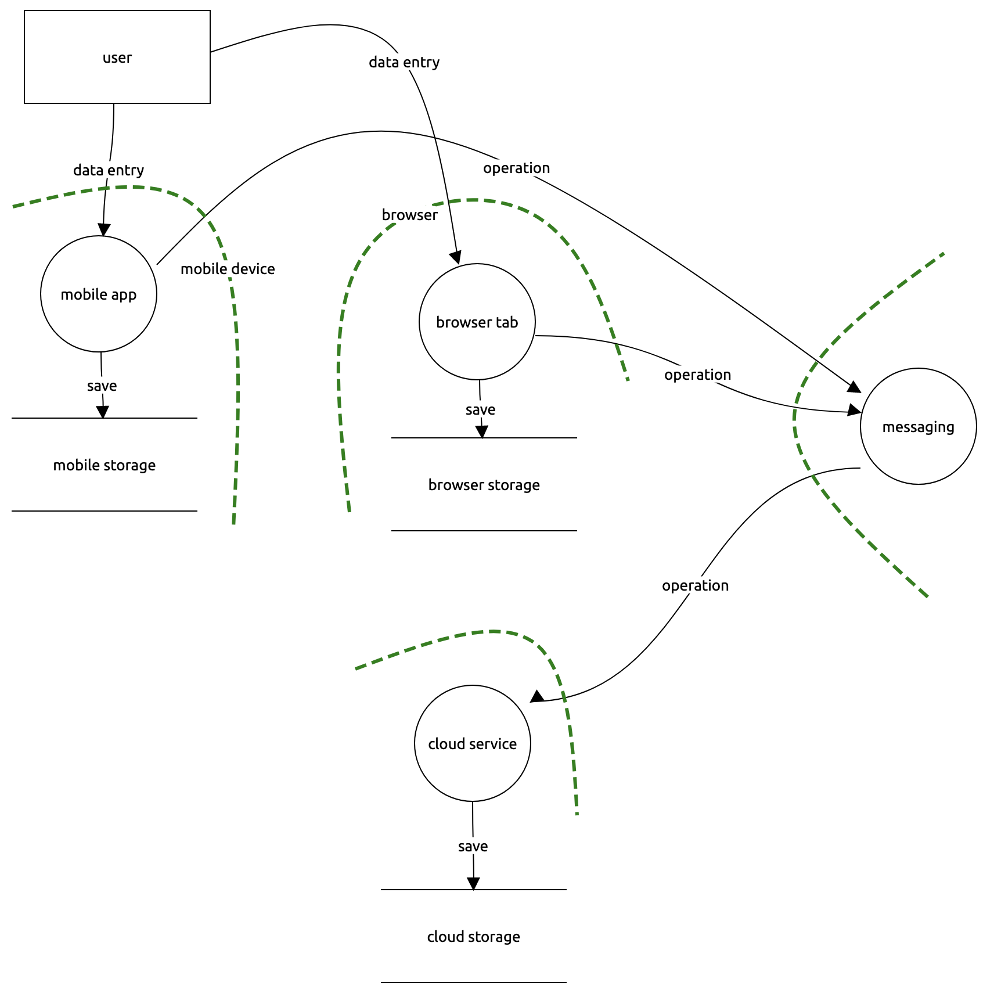

# Legal Groupware Threat Model

## 0. objectives

### confidentiality

### integrity

### availability

### auditing

### authentication

### authorisation

### management

## 1. application profile

### deployment

### users

### data

### dependencies

## 2. application composition

## 3. threats

### agents

| Agent | Motivation | Capability |
| ----- | ---------- | ---------- |
|       |            |            |

### attacks

| Category               | Attack | Vector | Agent |
| ---------------------- | ------ | ------ | ----- |
| Spoofing               |        |        |       |
| Tampering              |        |        |       |
| Repudiation            |        |        |       |
| Disclosure             |        |        |       |
| Denial-of-Service      |        |        |       |
| Elevation of Privilege |        |        |       |

