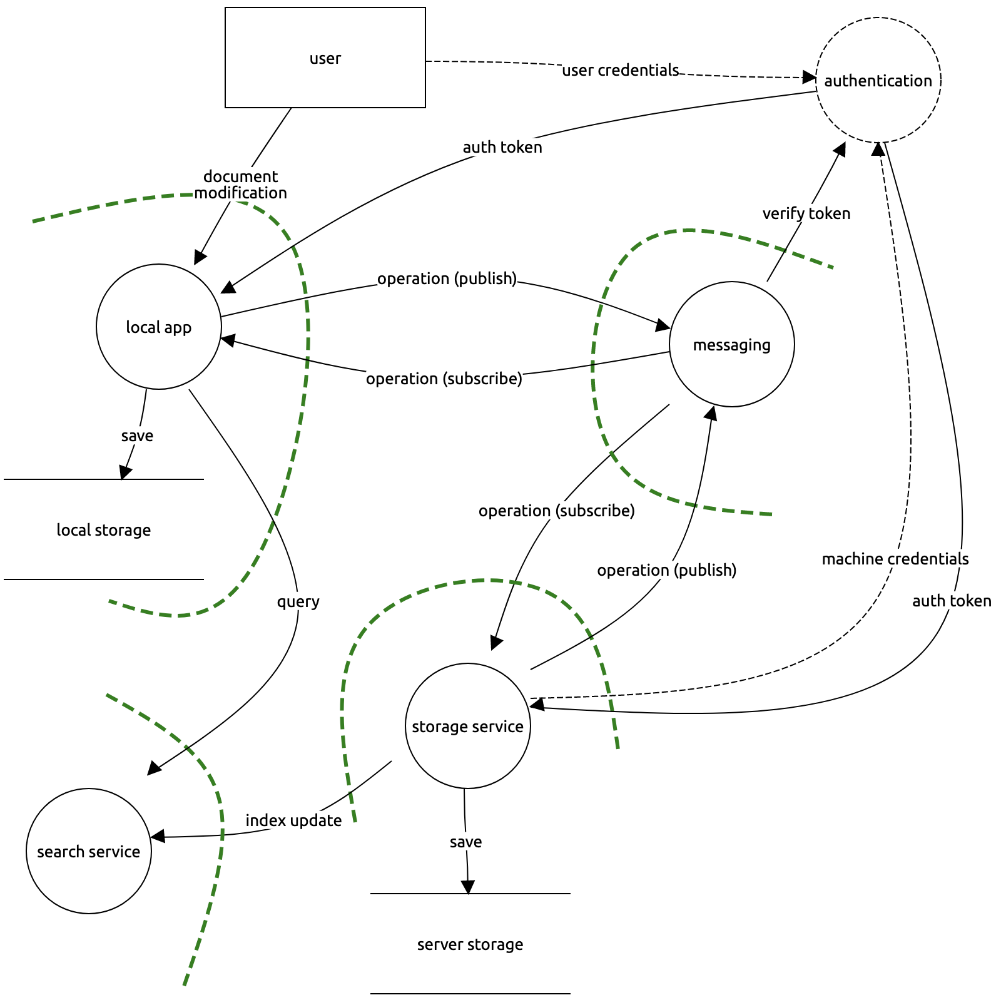

# Legal Documents Threat Model

## 0. objectives

### confidentiality

### integrity

### availability

### auditing

### authentication

### authorisation

### management

## 1. application profile

### deployment

### users

### data

### dependencies

## 2. application composition

## 3. threats

### agents

| Agent                                                        | Motivation         | Capability            |
| ------------------------------------------------------------ | ------------------ | --------------------- |
| Hacker (not so much) but we do consolidate information  | Money              | Malware Phishing |
| Internal – acting for defence or prosecution (or other cases) want to segregate internally ("information barriers") | Passive, bias      |                       |
| Client (who owns the data – lines badly drawn)               | Passive, data loss |                       |
| Opposing side (but not come across)                          |                    |                       |
| Cloud providers – we do want search indexing, but want to rescind (hence private encryption key) |                    |                       |
| Governments – e.g. USA federal law for backdoor? "It's not in the US is it" |                    |                       |
|                                                              |                    |                       |

### attacks

| Category               | Attack     | Vector | Agent |
| ---------------------- | ---------- | ------ | ----- |
| Spoofing               |            |        |       |
| Tampering              |            |        |       |
| Repudiation            |            |        |       |
| Disclosure             | Phishing   |        |       |
| Denial-of-Service      | Ransomware |        |       |
| Elevation of Privilege |            |        |       |

## references

https://www.lawsociety.org.uk/en/topics/cybersecurity/three-biggest-cyber-threats-facing-law-firms

https://www.lawsociety.org.uk/topics/cybersecurity/cybersecurity-for-solicitors

https://www.ncsc.gov.uk/report/-the-cyber-threat-to-uk-legal-sector--2018-report

## 
