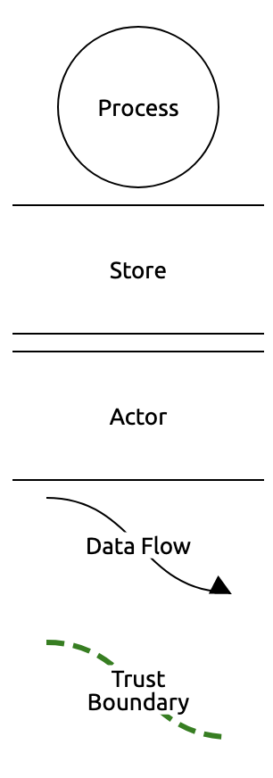

# Legal Documents Threat Model

*The motivation and structure of this document are described in the [folder README](https://github.com/m-ld/m-ld-security-spec/blob/e-invoicing/threats/README.md).*

This document presents a threat model for a peer-to-peer legal content system, _p2pl-doc_. The vision behind p2pl-doc is that barristers and solicitors, their clients, and key third-parties can collaborate on a digitial representation of key legal content, either independently, in real-time, or offline, as the situation demands; while also having certainty over data sovereignty.

The state-of-the-art for legal information management is transitioning from paper and generic e-document based workflows to specialised cloud-based systems, with significant advantages for the speed and efficiency of legal activities such as case preparation, delivery of legal advice, and conveyancing. However, conventional cloud-based systems can also present new complications, such as ensuring data sovereignty [@ettlingCloudBiggestThreat2015]; supporting offline working; and integrating with other IT systems (e.g. at corporate clients and courts) via a proprietary data interface.

p2pl-doc is intended to address these complications by decoupling data storage from app provisioning. The app offers editing (plus tagging & annotation) of legal content. It uses data storage local to where it is running; this can be on a user device or a server. Content is synchronised between locations using an information sharing component like **m-ld**. Thus:

- Data storage locations can be precisely specified per-document to alleviate concerns over sovereignty, while still supporting replication for fault-tolerance.
- The information sharing component natively supports offline and real-time collaborative editing in the app.
- Integration with other IT systems is facilitated by the use of a standard interface for content, designed for interoperation and portability (JSON-LD, in **m-ld**).

For the purpose of this document, we assume that the collaborative model of p2pl-doc is viable as a future model for legal content sharing, and focus on the security requirements which it entails.

> If p2pl-doc sounds like a great solution for your legal content sharing problem, we would be delighted to [hear from you!](https://m_-ld.org/hello/)

## 0. objectives

The function of a p2pl-doc system is to allow the parties involved in a legal engagement to share relevant 'documents', where the content of these documents may change over time. The content will often be highly sensitive in nature; may contain Personally-Identifiable Information (PII); and may be subject to localisation rules, e.g. they must not leave the country.

The image below from the [HyperLaw](https://www.hyperlaw.co.uk/) website illustrates the general form of a legal document management system.

- External document files may be imported or created from scratch
- Documents may contain legal content, which may be identified automatically by the system or by manual tagging
- Documents may be:
  - Organised into a case, carrying metadata such as client, legal matter and status
  - Editable in the platform, by multiple users
  - Annotated with comments, tags, and suggested edits
  - Subject to controlled workflows e.g. review and approval
  - Exported

In respect of all of the objectives below, law firms are very shaped by their clients needs and tend to be extremely risk averse – they want to be seen to be as secure as their client, and implementing ‘best practice’ security. There is no incentive to take a risk in pursuit of a goal unless the goal cannot be achieved without it, and the client is fully on-board.

### policies & standards

Here we focus on policies & standards relevant to the United Kingdom.

The "documents" in a legal document management system could be of any type, including highly domain-specific types if they are relevant to the case, e.g. computer-aided design files. Here, we restrict consideration of _content_ standards to 'legal documents', i.e. presentations of [legal instruments](https://en.wikipedia.org/wiki/Legal_instrument).

Even in this restricted domain, the approach to content has historically been for dedicated professionals (lawyers) to both produce and assess documents manually. This allows for significant variability and extensibility of content; it is also impossible to automate, and so, expensive. As a result, _comprehensive_ standards for machine-processable legal content do not exist as such.

[CEN Metalex](http://www.metalex.eu/) defines an XML Schema and OWL ontology for "sources of law and references to sources of law". While a legal instrument can be fully represented in XML or RDF using CEN Metalex, only metadata (e.g. versions, dates and references) are formalised; the body of the document is represented as plain text arranged in nested paragraphs.

Another formal XML schema, compatible with CEN Metalex but with more comprehensive metadata, is [Akoma Ntoso](http://www.akomantoso.org/?page_id=47). Its version 1.0 is adopted as an OASIS standard by the [LegalDocML](https://www.oasis-open.org/committees/tc_home.php?wg_abbrev=legaldocml) Technical Committee. These standards capture the characteristic paragraphs/clauses structure of a legal document.

For documents relating to court procedure, specific content forms may be required. In the UK, these are given as template Microsoft Word documents (e.g. for [criminal](https://www.gov.uk/guidance/criminal-procedure-rules-forms) and [civil](https://www.justice.gov.uk/courts/procedure-rules/civil/standard-directions/list-of-cases-of-common-occurrence) cases), typically only containing standard headers and required wordings.

Approaches to full machine-readability for legal content have included not only formalising it as ontologies [@casanovasSemanticWebLegal2016], but also as code [@Ma2020Writing], whether authored as such or inferred from text using machine learning algorithms. The ideas in this space are diverse and still largely academic; however startups are popping up, such as [Juro](https://juro.com/) for contracts, and [Legalese](https://legalese.com/aboutus), which is developing "user-facing web apps in different verticals and domains".

In respect of legal document _systems_, there is a similar lack of domain-specific regulatory standards. The UK Law Society provides a [Cybersecurity guide for solicitors](https://www.lawsociety.org.uk/topics/cybersecurity/cybersecurity-for-solicitors) which mandates adherence to the General Data Protection Regulation (GDPR) – because most legal instruments contain personal data – and otherwise makes generally applicable security recommendations. For cloud suppliers, it suggests a minimum of [ISO 27001](https://www.iso.org/isoiec-27001-information-security.html) compliance – a very general cybersecurity standard. The [NCSC](https://www.ncsc.gov.uk/) has also [issued cyber security advice](https://www.ncsc.gov.uk/news/cyber-security-advice-issued-law-firms-first-legal-threat-report) to law firms, but again this amounts to adherence to its generic [Cyber Essentials](https://www.ncsc.gov.uk/cyberessentials/overview) guidance.

Commercial legal document management systems in common use include [HyperLaw](https://www.hyperlaw.co.uk/) and [LawConnect](https://www.lawconnect.co.uk/). These are cloud services which advertise prioritisation of security, but as expected, not against any domain-specific standard. LawConnect have a public [Security Policy](https://www.lawconnect.co.uk/information-security-policy.html) page, with the following highlights (assigned to implied threats):

| clause                                                       | implied threats (STRIDE)                                     |
| ------------------------------------------------------------ | ------------------------------------------------------------ |
| 1. & 2. GDPR compliance                                      | Information Disclosure                                       |
| 4. Data Sovereignty and Integrations "highly available, active-active scalable solution situated in the ISO 27001 certified AWS datacentres in Dublin" | Spoofing Tampering Information Disclosure Denial-of-Service |
| 5. Data Encryption: "accessed via HTTPS using Transport Layer Security (TLS)" | Spoofing Tampering Information Disclosure          |
| 5. Data Encryption: "Data is encrypted at rest, using AES-256" | Tampering Information Disclosure                        |
| Appendix 3: Technical Measures: _a long list of generic measures_ | _all_                                                        |

HyperLaw advertise the [results of a penetration test](https://www.hyperlaw.co.uk/article/hyperlaw-successfully-completes-penetration-testing-with-network-security-experts-sec-1/), again demonstrating resistance to generic IT security threats. As a plus, they cite their utilisation of the Microsoft Azure platform.

Legal document management may also be subject to a number of other security-related policies, such as:

- Data sovereignty/locality: data must not leave a jurisdiction
- "No-cloud" policies: typically, organisations with their own data centres
- Traffic inspection e.g. [cloud access security brokers](https://en.wikipedia.org/wiki/Cloud_access_security_broker)
- Approved services lists (although this is not directly addressable)

### confidentiality

Legal documents are typically confidential; visible only to named users, associated with named organisations (if applicable); and they are subject to a high level of concern over accidental disclosure. Due to the prevalence of personal information, they are almost always subject to GDPR. In particular, data must be destroyed on client request at any time.

For barristers in particular, different lawyers in the same chambers could be acting for defence or prosecution (or on other cases); so access control must operate on an individual document basis.

Some legal document sharing scenarios can have very specific confidentiality requirements. These relate to the need to share very targetted content with the court or the opposing party.

- To 'black out' or 'white out' highly-specific portions of a document (not using e.g. text colour formatting or overlying rectangles, because they are reversible).
- To remove metadata such as version history and authors.
- To replace text with images as an impediment to copy/paste and indexing.

When using e-documents this has led to the common practice of printing out and re-scanning as an image.

When using p2pl-doc, such sharing should also break the link to the original document, so that no new updates are provided.

| losses                          | category                                 | indicative severity (depends on) |
| ------------------------------- | ---------------------------------------- | -------------------------------- |
| Disclosure of legal information | Response, Fines & Judgements, Reputation | High (scope of disclosure)       |

### integrity

As discussed in [§policies & standards](#policies--standards), legal content is very variable and not generally machine-readable, relying on expert assessment by lawyers and courts. Where schemas are available, they define metadata rather than content. However, for legal documents a structure of numbered and nested paragraphs usually expected, and metadata and annotations may apply at the level of language structure (e.g. paragraph, sentence, word).

However, in cases where specific headings or wordings are required, such as for court procedure documents, non-conformance can cause delays.

In addition, future directions for ontology- or code-driven formalisation of content (hereafter 'content form') for a much wider range of documents should be supported. This would allow conformance to an expected document structure to be machine-checkable, saving time and money.

| losses                                        | category     | indicative severity (depends on)      |
| --------------------------------------------- | ------------ | ------------------------------------- |
| Non-conformity to required document structure | Productivity | Medium (procedure complexity & stage) |

### availability

The p2pl-doc system must be sufficiently available so that it is never a bottleneck in client interactions or legal proceedings. It should preferably be available to an offline party – with the proviso that they will not see the activities of other parties. (UK courts [have Wifi available](https://www.gov.uk/government/news/improving-wifi-in-our-criminal-courts) for use by legal professionals; but anecdotally it is not always reliable.)

| losses                    | category                 | indicative severity (depends on)   |
| ------------------------- | ------------------------ | ---------------------------------- |
| Client interaction delays | Productivity, Reputation | Medium (attacker capability)       |
| Legal proceedings delays  | Productivity, Reputation | High (attacker capability & stage) |

### auditing

Auditing of the p2pl-doc system should support GDPR compliance and general business practice audits. Document snapshots filed in other systems (e.g. the [HMCTS Common Platform](https://www.gov.uk/guidance/hmcts-services-common-platform)) should be traceable to their equivalent version in p2pl-doc and attributable, non-repudiably, to specific users.

There is otherwise no regulatory requirement for fine-grained attribution of individual edits to specific users, although some version history capability is generally expected in document management systems.

| losses                 | category                       | indicative severity (depends on) |
| ---------------------- | ------------------------------ | -------------------------------- |
| Litigation (e.g. GDPR) | Fines & Judgements, Reputation | Medium (legal fees & fines)      |

### authentication

A user must be strongly identified and authenticated for access to a legal document according to their §[authorisation](#authorisation).

In some cloud-based document sharing systems (e.g. Google Docs, Microsoft Office, Slack), it is not possible to make explicit requirements of the authentication policies of other tenant organisations, e.g. to mandate two-factor authentication (2FA). Solutions to this may be unsatisfactory:

- Conduct a security audit of the organisation; this can be expensive and time-consuming, as it depends on security or IT staff.
- On-board the other party to the source tenant; this can be awkward if the system is linked to the organisation's directory (e.g. Microsoft Active Directory).

p2pl-doc should make it possible to enforce a consistent security policy for authentication.

Other requirements on the authentication system itself are out of scope.

| Losses                                                   |
| -------------------------------------------------------- |
| *per confidentiality, integrity, availability, auditing* |

### authorisation

In addition to read permission, named users (see [§confidentiality](#confidentiality)) may or may not have permission to make changes to documents. The following example information scopes may be subject to differential access rights:

| scope                                                        | typical edit rights   |
| ------------------------------------------------------------ | --------------------- |
| Document metadata (e.g. identity, version, date)             | not directly editable |
| Document information (e.g. title, tags)                      | authors               |
| Paragraph structure & text                                   | authors               |
| Content form (if applicable, see [§integrity](#integrity); may constrain the above) | creator               |
| Annotations & suggestions (redline)                          | authors & reviewers   |

| losses                                                   |
| -------------------------------------------------------- |
| *per confidentiality, integrity, availability, auditing* |

### management

Management of a p2pl-doc system may include:

- Regulatory auditing (see §[auditing](#auditing));
- Local IT system administration;
- Installation, maintenance and training activities;
- Dependee system administration (e.g. directory system; out of scope);
- Development and testing activities, including penetration testing.

Other management roles depend on the deployment model, and may include system and database administrators.

All management activities, when conducted according to normal ICT security good practice standards e.g. ISO 27001, should maintain the other objectives above.

Personal mobile and desktop devices should not need to have special security settings applied at the operating system level (although they may do, for example according to an organisational policy).

| Losses                                                   |
| -------------------------------------------------------- |
| *per confidentiality, integrity, availability, auditing* |

## 1. application profile

This section describes a hypothetical p2pl-doc application, using decentralised sharing of legal documents, with only enough detail to elucidate applicable security threats.

For the purposes of a manageable scope and applicability to **m-ld**, in the application we will consider documents with the conventional numbered paragraph structure, which may conform to some schema (e.g. ontology-based or a content form). Other documents, and generic groupware functionality (e.g. tasks and calendaring) which may be bundled in commercial legal document management systems are not considered.

### deployment

The users of p2pl-doc interact with the system and each other via an app, available on mobile or desktop devices. For convenience, a web app should also be available. In all cases, the app will use local storage to persist document state between sessions, allowing an offline session to be interrupted without data loss.

Icons made by [xnimrodx](https://www.flaticon.com/authors/xnimrodx) and [Vitaly Gorbachev](https://www.flaticon.com/authors/vitaly-gorbachev) from [www.flaticon.com](https://www.flaticon.com/)

Users of the system will access each other and dependee systems via a local network or the internet. The users are identified using an _identity service_ (also performaing authentication), which is shown as a cloud service but could also be deployed at the law firm.

While fully peer-to-peer message delivery options are possible, they are not in widespread use, and so we model a _message broker_ as a service on the cloud, which is responsible for delivering control messages and document change operations. The broker may be implemented as a single server, a cluster, or a world-wide service; but for our purposes we will assume a process with its own trust boundary. (In anticipation of design, note that the broker does not need access to message content, so messages can be encrypted end-to-end.)

For persistence of the document between sessions, and for parties to be able to access the latest available information whether or not another party is online, a copy of the document will be stored in a service accessible to all parties – the *storage service*. This persistent copy will be kept up-to-date as the network allows when edits are made; recognising that at any time, a party might have a local copy that is more recently updated, for example if they are offline. 

The storage service can be partitioned and replicated easily, usually without IT support, by the law firm – including to the cloud or to the client organisation (it is shown deployed to the law firm, as the default). Each partition of the service can serve separate documents. This means that persistent copies can be physically relocated to comply with data sovereignty or other client requirements, without degradation of service, so long as at least one location serving the document is sufficiently available.

A key feature of document management systems is the ability to search across documents. This presents a challenge to a peer-to-peer system, in which there is no central repository to be indexed – and possibly not even a central registry of what documents exist. Therefore we propose a search service based on the cloud, which is responsible for directing searchers to specific documents, while respecting access control. For example, it should not be possible to infer the content of a document to which you do not have read access, by finding it with a search term.

### users

Users of the p2pl-doc system are employees of a law firm, primarily lawyers and executives, and their assistants; and clients of the firm.

With respect to individual documents, users can have specific permissions, similar to other document sharing systems, such as owner, viewer, editor and reviewer. Permission assignments can change at any time (with the proviso that there is always an owner); and the system should be flexible enough to support other permissions in future (e.g. approver).

### data

The data in a p2pl-doc system consists of legal documents. In this threat model we will not attempt to perfectly model all legal documents, so the analysis here is intended to be indicative and sufficient for a threat analysis.

Each document's information has a structure that is given by a schema, which is extensible. The base schema contains:

- Metadata e.g. Document identifier, Title, Date, Author(s), Type/Legal Matter, Language, Status
- Clauses (nested numbered paragraphs)
- Definitions (glossary)
- Tags, Comments, Suggestions ('redline'; associated with clauses)
- Signature(s)

Refinements of the base schema are available for specific document types. E.g. a [witness statement](https://www.justice.gov.uk/courts/procedure-rules/civil/standard-directions/general/witness-statements) additionally contains:

- Case and claim number
- Full name and address of the witness
- Mandatory declaration: 'I believe that the facts stated in this witness statement are true.'

It should be possible for the system to not only validate the document against the schema, but to use the schema to guide authoring, e.g. by automatically adding the mandatory declaration into a witness statement.

Further, since so little legal content is machine-readable, one possible benefit of a schema-based system is to encourage a network effect, in which users of the system contribute new schemas as they arise; these are then available for re-use in the same organisation or even between organisations. So, the definition of the schema itself should be editable – with suitable authorisation controls.

### dependencies

| third-party system                   | required | purpose & notes                                              |
| ------------------------------------ | -------- | ------------------------------------------------------------ |
| identity management                  | required | Provides identities for user authentication                  |
| authentication system                | required | Authenticates users to the required level of assurance and provides tokens or keys to the application so that it can act on behalf of the user. |
| court digital case management system | optional | An example target for export of legal documents, traceable back to the p2pl-doc system |

## 2. application composition

The data flow diagram shows the processes, data stores, actors, data flows and trust boundaries which are subject to threats. Note that compared to the [deployment](#deployment) diagram above, only one user is shown, to avoid duplication for other equivalent users.

|  | key  |
| ----------------------------------------------- | ----------------------------------------- |

### user

The human user of the legal document system interacts with the authentication service to obtain an authentication token which is valid for the local app. In this model we do not specify the implementation details of the token creation; nevertheless, something like [OpenID Connect](https://openid.net/connect/) would be typical. The authentication service itself is out of scope.

Once authenticated, the user makes modifications to the legal document (authoring, tagging, commenting, suggesting, etc.), according to their access rights.

### local app

The local desktop or mobile app accepts modifications from the user and updates the local state of the legal document. The update are propagated to other copies of the legal document by publishing them to the messaging service. Changes are also propagated to the local storage on the device, so that if the network is unavailable, they are not lost when the app is closed or otherwise terminates.

Note that document modification, operation publication and saves to local storage may be subject to batching or other optimisations to limit traffic.

When appropriate, the user can instruct the app to export a document to some third-party system.

### messaging

The messaging service propagates document modifications to every remote copy of the legal document in a publish/subscribe pattern. Each published message is delivered to multiple subscribers concurrently ("fan out").

In order to publish and subscribe to the messaging service, any client must present a valid authentication token. This token is verified with the authentication service as required (not necessarily with every client interaction).

Note that the messaging service may be implemented as a cluster or even a global service spanning data centres and edge devices.

### storage service

The storage service maintains a persistent copy of each legal document, so that if a user device rejoins the collaboration, it is able to 'see' the most recent state possible (not including edits made on offline devices that have not yet re-connected). It also sustains a level of data safety in case user devices are destroyed. It therefore acts as a subscriber to the messaging service, for which it needs an authentication token (as decribed above). In this case, this is a machine token, not representing any specific user.

This service also updates the search service with the latest searchable terms from the documents.

### search service

The search service maintains an index of available legal documents (see [§deployment](#deployment)). It is updated by the storage service, and queried by the local app when requested by the user.

## 3. threats

### agents

| agent                                                        | motivation                                                   | capability                                                   |
| ------------------------------------------------------------ | ------------------------------------------------------------ | ------------------------------------------------------------ |
| Legitimate user                                              | Grievance Whistleblowing Corruption Biasing the case Accidental | Disclosure via side-channel Incorrect content entry Device loss Setting up incorrect permissions on documents |
| Opposing counsel (note: very unlikely to mount a direct, deliberate attack) | Accidental                                                   | Access to shared case documents e.g. witness statements      |
| Opposing party (e.g. plaintiff/defendant)                    | Strengthening their argument Biasing the case           | As public; but may engage hackers                            |
| Cloud provider                                               | Analytics User profiling                                | Direct access to storage Cookies                        |
| Government                                                   | National security                                            | Requests for data under surveillance acts                    |
| Hacker / hacktivist                                          | Direct financial gain Whistleblowing Bribery, ransom Blackmail | Miscellaneous attacks via network Malware Phishing |
| System Administrator                                         | *as legitimate user*                                         | Direct access to components Incorrect security configuration |

### attacks

| category               | goals                                                        | attacks                                                      | agents                                                       |
| ---------------------- | ------------------------------------------------------------ | ------------------------------------------------------------ | ------------------------------------------------------------ |
| Spoofing               | Elicit illegitimate payments, e.g. to third-party account Submit illegitimate evidence | Identity theft                                               | Hacker Opposing party                                   |
| Tampering              | Falsify evidence                                        | Message forgery Identity theft Direct tampering of storage | Legitimate user System administrator Hacker        |
| Repudiation            | Deny legitimacy of evidence                                  | Signature forgery Identity theft Direct tampering of storage | Legitimate user                                              |
| Disclosure             | Discovering personal information or secrets of opposing party  | Communication interception Identity theft Direct access to storage | Opposing party Hacker Government                   |
|                        | Tracking & profiling                                         | Social engineering e.g. unclear terms of use Direct access to storage | Cloud provider                                               |
|                        | Accidental disclosure                                        | Incorrect security setup for the system, folders, or documents | Legitimate user System administrator                    |
| Denial-of-Service      | Delay proceedings                                            | Data volume (e.g. large documents) Data velocity (e.g. generated messages) | Opposing party Hacker System administrator         |
| Elevation of Privilege | *other attacks*                                              | Injection Identity theft Social engineering        | Legitimate user System administrator Opposing party |

### vectors

| attack                      | components                                    | comment                                                      |
| --------------------------- | --------------------------------------------- | ------------------------------------------------------------ |
| Identity theft              | Authentication                                | *Out of scope*                                               |
| Message forgery             | *all data flows* Messaging               | Can occur in the network or at process boundaries            |
| Direct tampering of storage | Local storage Server storage             | Requires direct access to components                         |
| Signature forgery           | Local app Messaging Storage service | Requires direct access to components e.g. injection of dynamically-loaded components |
| Communication interception  | *all data flows* Messaging               |                                                              |
| Denial-of-service           | Messaging Search service                 |                                                              |
| Injection                   | Local app Search service                 |                                                              |
| Social engineering          | User                                          |                                                              |
| Incorrect security setup    | Local app                                     | e.g. Difficulties setting up the right access controls on a document, and verifying that the access controls are working as intended |

## 4. summary

The p2pl-doc system proposed can be characterised as a hybrid centralised/decentralised information system, in which authority over document content is distributed between legal professionals and their clients. The system would have multiple integrations, including to incumbent centralised document management and groupware systems, and to state-owned cloud systems.

Documents in conventional legal document systems are semi-structured in the software, with partial or no formal schemas, while being perceived as strongly structured by their human authors – future systems that close this gap will be able to offer lawyers increased efficiency with re-use of common patterns, and semantically-aware features like suggestions and similarity searching. One way to encourage this would be to offer schema editing alongside content editing, so the benefits are immediately apparent. This requires fine-grained authorisation controls.

The most important threats to a p2pl-doc system relate to disclosure of private information. Threats to integrity are generally mitigated by the existing strong culture of review and approval; as automation becomes more prevalent, these will become more severe. Threats to auditing are not generally different to a conventional document management system; and availability risks are mitigated by the possibility of fallback to conventional practices.

---

_For bibliographic references, see the [project references file](../references.bib)._
