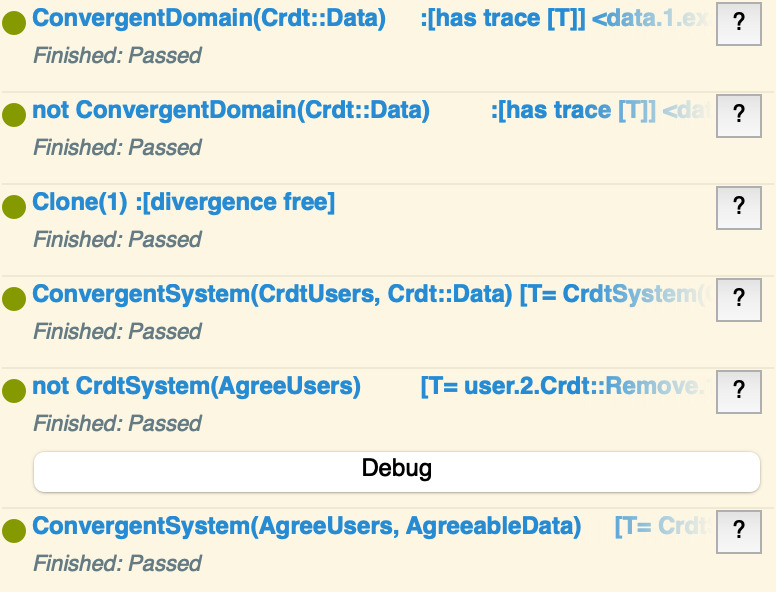

# formal verification

## abstract

This milestone further explored the [security design](https://github.com/m-ld/m-ld-security-spec/tree/main/design) established in this project using a formal verification language. Previously in the project we established that the core property of the **m-ld** model required for security is to support the use of coordination with the base SU-Set CRDT, still guaranteeing data convergence irrespective of the coordination used. Formal analysis and model checking was therefore applied to our design for this core feature.

## scope

During the design and prototyping phases of this project, we determined that the required security properties could be delivered primarily as _extensions_ to the **m-ld** core, using custom vocabularies and implementing access control lists, cryptographic transport security, and coordination protocols. This has the desirable property of _decentralised extensibility_: it is possible, without deference to any authority, to replace the extensions with others more suited to a particular use-case.

The core concept required for this approach is _agreements_, which define cuts over causal history through which all clones are required to pass – any incompatible messages arising due to concurrency being removed from history (_voided_). (To re-state the answer to an obvious objection: such voiding _only_ arises if the coordination protocol, which is a precondition of the agreement, has been missed or ignored by participating nodes. So voiding can be thought of as a backstop against, for example, incomplete consensus, that still guarantees data consistency.)

In order to model agreements and voiding, it was necessary to first construct a model of the CRDT. It's not currently possible to build a model in a formal language (process calculus, in this case) which depends on an implementation built in a conventional programming language. (If we had chosen a pure functional language like Haskel, or a logic programming language like Prolog, this constraint might have been relaxed; but still likely impossible in the time.)

A formal verification language is characteristically capable of modelling at different levels of abstraction. In the Communicating Sequential Processes (CSP) calculus (see [§tooling](#tooling)), this is a necessary part of model checking; desirable properties of a model are encapsulated as abstract models themselves, and the relationship between them checked in the tool by exploring possible states of the system.

Therefore, the scope of this milestone had the following main tasks:
1. Background research on approaches to formal verification of strongly eventually consistent systems
2. Establishing necessary tooling & re-familiarisation with the chosen formal language
3. Modelling of a toy CRDT (integer sum) to help with 1 and to explore a suitable abstraction level for the main model
4. Modelling a realistic CRDT, closely related to SU-Set and having the same message delivery requirements
5. Modelling causal message delivery
6. Establishing a specification model for data convergence, and checking that the CRDT+message delivery satisfies it (and, for comparison, that a naive non-CRDT data structure does not)
7. Adding a specification model for agreements, and checking that a modified CRDT corresponding to the prototyped **m-ld** core satisfies it

## related work

Most of the computer science literature on Conflict-free Replicated Data Types, such as Shapiro's seminal 2011 paper [shapiroConflictFreeReplicatedData2011], has a strong basis in mathematical analysis and proof. While a pure mathematical approach could be used to define the intuitive concept of an agreement (and possibly should be), it is hard to relate such a model directly to an implementation, and so find so-called 'deep bugs', without the support of a more specific-purpose language.

In our case, the primary problem being solved is in the domain of concurrent and distributed systems. Two candidate languages for formal verification of such systems stood out in our research. The Temporal Logic of Actions (TLA) [presslerTLAPracticeTheoryPart2017] is a general framework for describing and reasoning about algorithms and systems. [TLA+](http://lamport.azurewebsites.net/tla/tla.html) (a specification language based on TLA, in which time is a first-class citizen) is in use at Intel and Amazon Web Services, among others. Further, TLA+ has been used specifically for the purpose of verifying CRDT designs [zhangMETModelCheckingDriven2022], including generating test cases for implementations.

Another formalism specifically created for such systems is Communicating Sequential Processes ([CSP](http://www.usingcsp.com/)) [hoareCommunicatingSequentialProcesses2015], a process calculus, with an associated lazy functional language, CSPM. While we are not aware of any use of CSP specifically for verifying CRDTs, it has been studied extensively for closely-related topics such as conflict and causality relations [kwiatkowskaPossibleGuaranteedConcurrency1995] and fault-tolerance (aboard the ISS) [buthCombiningMethodsLivelock1999]. A particularly attractive property of CSP is that it fully abstracts away the concept of time, with the advantage that "designs and reasoning about them are simplified, and furthermore can be applied to physical and computing systems of any speed and performance" – which is particularly relevant to **m-ld**.

For this reason, and since we have prior experience with CSP and limited time for this milestone, we chose it over TLA+.

## tooling

CSPM does not have a dedicated editor, so we chose to use our usual IDE with a custom file type definition, giving useful features like keyword highlighting and bracket pairing.

Model checking CSP definitions can be done using [FDR4](https://cocotec.io/fdr/). This tool has a user interface for its main functions but it can also be used on the command line; and this was utilised to provide immediate type-checking of CSPM definitions. Overall, this allowed a satisfactory environment for modelling.

## code

The main source file used for model checking is `verification/csp/using-clocks/domain.csp`. Note the use of `include` statements to bring in other files. Source files are commented.

The following screenshot shows CSP assertion results for the file above.

As noted below, an alternative model for causal delivery was developed, and eventually abandoned. It can be found, for interest, in `verification/csp/using-causal-remotes/domain.csp`, but note that its assertions are probably no longer useful or valid.

## challenges

These challenges arose during the modelling and model-checking, and resulted in a smaller scope of analysis that we had hoped.

### convergent state

The initial exploration of the toy integer sum CRDT immediately highlighted an interesting conundrum with modelling Strong Eventual Consistency (SEC) [shapiroConflictFreeReplicatedData2011]. SEC requires that:
1. An update delivered at some correct replica is eventually delivered to all correct replicas
2. Correct replicas that have delivered the same updates have equivalent state

The first property belongs intuitively to the messaging substrate. While this is could obviously be subject to formal verification, it is abstracted in **m-ld**'s specification and implementation, and not affected by agreements. So we take this to be a precondition, and model the messaging substrate as fully abstract, having the following sub-properties:
1. Every message between a pair of clones is delivered in-order (First-In First-Out, FIFO)
2. No messages are dropped (lossless)

In CSP, this is straightforward to model as 'pipes', which are processes accepting a `send` event specific to some source process (a clone, in this case) and carrying some data payload, and sometime later emitting the same payload to some target process with a `receive` event:

Note that while this has the appearance of a 'mesh' network, which implies an implementation having certain properties (such as every node in the network having knowledge of the network address of every other), this is actually a fully abstract model which could be implemented in a variety of ways, including using a central message broker.

The conundrum arises in the modelling of the second property, that of state equivalence after update receipt, or 'convergence'. Note that this requires _the same_ update messages to have been received. In a live system of effectively infinite processes (which is the ideal to which we aspire in our model), at any moment in 'time', according to some global wall clock, there is no guarantee that any two clones will ever have received the same updates (trivially, a clone can always emit another update of its own before it receives someone else's).

To overcome this, we need a contrivance in the model to 'stop time' and allow all updates to propagate, before checking for convergence. We chose to simply limit the number of updates. Every clone counts the number of messages it has sent or received from each peer, and when the requisite count has been reached the clone stops (in CSP, it becomes the Stop process). While this works, and also has the useful necessary property of bounding the state space (see below), it does add code to the model which is purely for the sake of the model – it is not modelling anything that would exist in an implementation. This might sound puritanical, but it negatively affects the use of the model for specification purposes (see [§future work](#conclusions--future-work)).

### complexity & casual remotes

Once the integer sum CRDT was successfully demonstrating the convergence property – strictly, it was a refinement of a process that (only) exhibits convergence, see below – we moved on to modelling an OR-Set CRDT. This choice was made because OR-Set is closely related to the core **m-ld** CRDT, SU-Set [ibanezLiveLinkedData2013]. The primary differences between them are:
- OR-Set models a Set of arbitrary comparable items; SU-Set models a Set of RDF Triples
- SU-Set allows for batched update messages, modelled after SPARQL Update

Even when modelling agreements, there is no need for the process model itself to inspect data _content_. Instead, checking that it has converged to the same (particular) value is part of an _assertion_, these being separate statements in CSP. If we had moved further and begun to check, for example, authorisation based on permissions in the data, this would change (although it still might not require actual triples, but simply semantically-charged marker items in the Set).

OR-Set and SU-Set require _causal ordering_ [raynalLogicalInstantaneityCausal2000] of update messages. To ensure causal ordering in our model system, we chose to use vector clocks. Again, this is not the actual clock type used in m-ld, which is a 'Tree Clock', but it has the same significant properties and is therefore suitable as an abstraction:
- Every process (clone) has an identity
- The clock maps each identity to a count of events (ticks)
- Clocks are exchanged in the payload of update messages

Having modelled vector clocks, we encoded causal ordering in the clone process by buffering out-of-causal-order messages, in the normal way. In CSP, this buffering is neatly modelled by simply not accepting a message `receive` event until its 'causes' (the prior messages in the ordering) have been received.

Unfortunately, having done this, model checking in FDR became unacceptably computationally expensive, so the extent that it would either 'spin', making no progress on model evaluation (but still able to cancel), or lock up completely, requiring a force quit of the process, or sometimes even a reboot.

Our first thought was to 'throw hardware at it'. FDR is designed to be able to run on clustered high-performance compute, and we have experience setting up such systems on the cloud. However, without having characterised the scale of the problem, this could have been expensive and futile – for all we knew, the algorithm could be genuinely spinning, such that no amount of compute would allow it to complete, or it would take 10,000 years. So we decided to continue experimenting with the model, to simplify it and in particular to reduce the potential 'state space' being explored.

The reason we suspected a 'state explosion' as being a root cause, is that a vector clock has a large number of possible states even if each process's ticks are bounded. For example in a model with three processes the initial vector is `(0,0,0)`. If each process is bounded to 2 transactions, then the maximum tick for a process is 3 × 2, thus the maximum vector is `(6,6,6)`. The state space (with no knowledge of what tick combinations are possible at a given moment) involves exploring all permutations (e.g. 120, for two allowed ticks) _for every clone state and every message_.

A difficulty we discovered working with the model checker, is that it actually _does not_ explore the entire possible state space, having various internal optimisations to avoid doing so. Naturally this is great for the end result, but it is very hard to know where to apply hand optimisations to help it along when it is clearly having a hard time.

The following attempts at mitigation were made, in summary:
1. Since adding clocks caused this problem, we initially tried to work on a centralised Remotes that stored its own internal state for every process and thus was able to internally order messages by their causes in queues, without using clocks. The CSP model for this has been retained in the folder `verification/csp/using-causal-remotes`. Unfortunately this actually exhibited worse model checking behaviour than the clocked version, and so was abandoned.
2. As noted above, we were already constraining the possible vector clocks receivable in messages _at a given clone state_, to enforce causal delivery. By itself, this has surprisingly little effect on the state space, because it does not constrain the ticks of the sender or the recipient (so with three clones, it only affects one vector position, that of the third party); and as the number of received messages increases, so does the number of allowable causes. However, by storing additional information about each known peer, such as the _last_ received message clock from that peer, it's possible to add additional constraints, such as the expectation that a clone's declared tick will only ever increase, and even to predict exactly what future values it _might_ have. The applicable logic here is surprisingly involved and can be found in the `Gwc` module, in `verification/csp/using-clocks/Clock.module.csp`. The troubling thing about this approach is that it's redundant with the behaviour of the rest of the model: we are encoding state constraints which are directly mathematically inducible from clone and remote behaviour. 
3. An optimisation that actually had nothing to do with clocks, which we discovered by accident, was to enact broadcast publishing of update messages _sequentially_ to peers rather than _in parallel_. With parallel broadcast the model checker would spin forever. The clue that led to this discovery was a compilation optimisation documented in the FDR manual, _partial order reduction_. However why such an optimisation works in this case, and specifically for publish, is a complete mystery and speaks to the generally opaque nature of FDR.

As can be seen from `verification/csp/globals.csp`, the findings below were made using three clones, two values in the data set, and one (!) user transaction per clone, this being the usable upper bound allowing completion of model checking the domain model on a 3.2 GHz Quad-Core Intel Core i5, 16GB memory iMac. No doubt improvements to this could be found by further hand-optimisations (including of options in FDR), and also by, finally, 'throwing hardware at it'. Note however that these bounds are simply constants in the model, which otherwise logically allows any bounds value.

## findings

### agreement specification defects

The initial model for agreements followed the pattern outlined in the [SUAC protocol design](https://github.com/m-ld/m-ld-security-spec/blob/main/design/suac.md#protocol) and implemented in the prototype. However, model checking found a counterexample showing that clones could incorrectly void recent received operations, see the logged defect here: [_Agreement concurrency detection should ignore internal ticks_](https://github.com/m-ld/m-ld-security-spec/issues/16).

While analysing this counterexample and planning a resolution in the model, we also found a further defect: [_Free operations concurrent with an agreement are not necessarily contiguous in history_](https://github.com/m-ld/m-ld-security-spec/issues/17).

Both of these defects were fixed in the CSP model, which then passes the refinement checks for agreements.

### concurrent agreements

A known limitation of the agreements protocol design has been the lack of a specified behaviour when agreements themselves are concurrent and affect the same data. (Noting that this should be even more rare than voiding – not only has a clone missed the existence of a consensus, it has actually attempted and succeeded at its own consensus in parallel; which rather calls into question the efficacy of the consensus protocol.)

In fixing the defects above, we have now resolved this under-specification. In summary, it is not _all_ operations concurrent with an agreement that are subject to voiding; but instead, only "free" operations, which are neither an agreement themselves, nor a cause of one. This means that concurrent agreements actually resolve with the normal conflict-free merge behaviour of the core CRDT (and any applicable constraints).

Intuitively, this specification may not provide a 'useful' behaviour for the simulation of other concurrency models (such as serialisation), and also may not account for all possible concurrency cases – we need to do more analysis, preferably by extending this formal verification.

### agreements as a generalisation of two-phase commit

As a more philosophical finding of this analysis, we noticed that agreements have a similar structure to the familiar two-phase commit (2PC) protocol of Database Management Systems (DBMSs):

|              | 2PC                       | agreements                                               |
|--------------|---------------------------|----------------------------------------------------------|
| phase I      | "commit-request"/"voting" | proof generation in a constraint                         |
| phase II     | commit                    | publication of agreed operation                          |
| coordination | single coordinator node   | extensible – any protocol that can be proven             |
| CAP*         | CP, blocking              | AP with risk of voiding, unless coordination is blocking |

* Consistency or Availability under Partitioning (here adopting this [questionable labelling](https://martin.kleppmann.com/2015/05/11/please-stop-calling-databases-cp-or-ap.html) in part to acknowledge a need for further analysis).

We would like to look into:
1. what we can learn from 2PC implementations to improve the practical implementation of agreements;
2. whether agreements are actually a generalisation of 2PC, and so useful as a mechanism applicable to other decentralised or eventually-consistent systems.

## conclusions & future work

As expected, the formal analysis in this milestone not only involved precisely defining models in the chosen formalism, but also choosing the properties to model at an appropriate level of abstraction – where this level is initially freely chosen and lacking an upper bound (so, very different to building software implementations). Coupled with the time-consuming [challenges](#challenges) encountered, our final [scope](#scope) of analysis was a foundational but undeniably small part of what could be formally verified in **m-ld** and our security design.

Nevertheless, the analysis yielded useful [findings](#findings), which we will take forward in research, and the **m-ld** specification and its implementations.

Particularly with regard to specification, we have a need to document the **m-ld** protocol ([task︎](https://github.com/m-ld/m-ld-spec/issues/11)), and CSP may be a candidate notation for this:
- [good]︎ implementation-language independent
- [good]︎ oriented to concurrent & distributed systems
- [bad] unlikely to be familiar to the specification audience (potential contributors)
- [bad] prone to ['pollution' with model-checking optimisations](#complexity--casual-remotes) (although this may be avoidable with more experience)

We have identified the following potential scope for future formal modelling and verification in the **m-ld** project:

1. Extension of the model-checking bounds for the agreements model to include more clones and user transactions (possibly requiring cloud high-performance compute); OR a satisfactory argument that this is not needed due to Data Independence [roscoeUnderstandingConcurrentSystems2010].
2. Model checking of security-specific extensions, built on the crdt+agreements model, such as Permissions and Statutes.
3. Proof, via refinement checking, that the crdt+agreements model is able to simulate other concurrency models in common use, such as (the relevant properties of) ACID and blockchains – not necessarily with perfect fidelity, but still with a well-defined relationship.

## bibliography

> Please see [/references.bib](https://github.com/m-ld/m-ld-security-spec/blob/main/references.bib)

## notes

